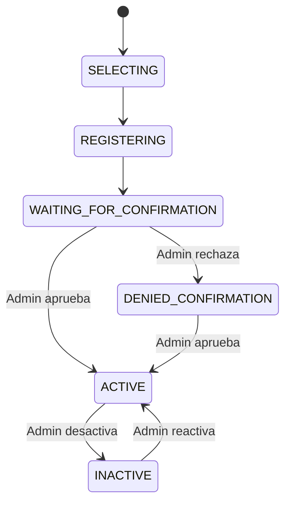
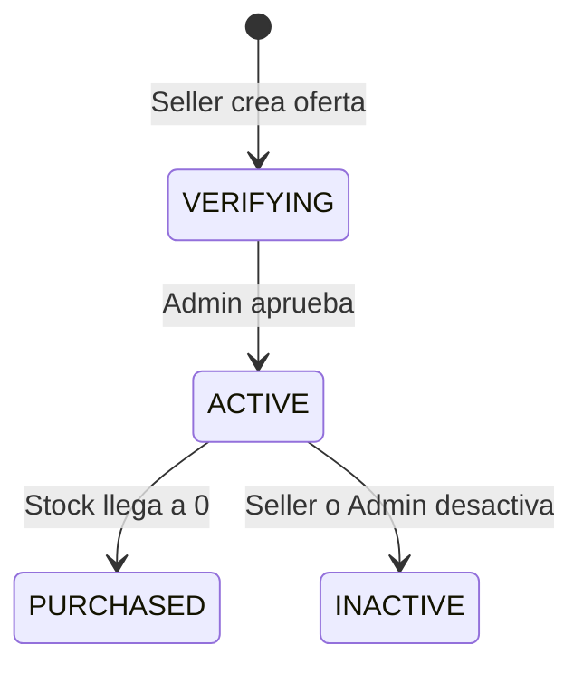
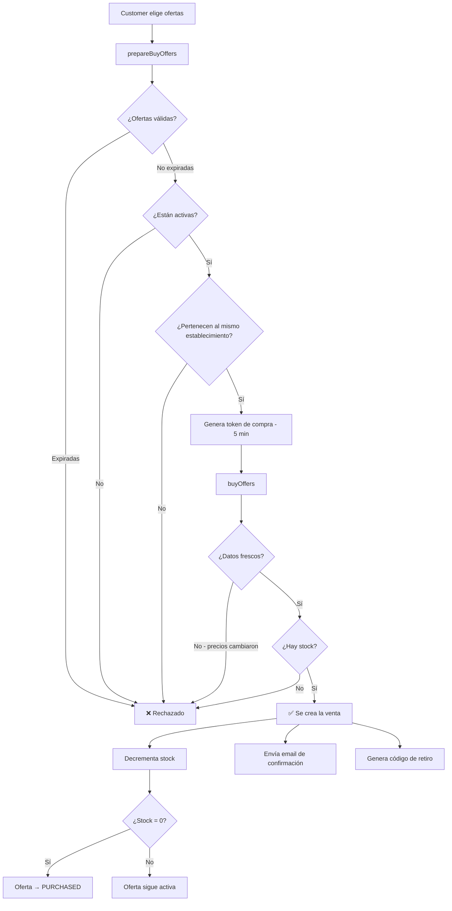

# Análisis: Lógica de Negocio en Tatelestai

## ¿Qué es Tatelestai?

Una plataforma web que conecta **establecimientos de comida** con **compradores** para vender **excedentes de alimentos** a precios accesibles, reduciendo el desperdicio alimentario.

Los **tres actores** del dominio son: **Admin**, **Seller (vendedor)** y **Customer (comprador)**.

---

## 🟢 ESTO SÍ ES LÓGICA DE NEGOCIO

Son las reglas que existirían aunque no hubiera software. Le podés explicar cada una de estas a alguien que no sabe programar.

---

### 1. Máquina de estados del vendedor

**Archivos involucrados:**

| Archivo                                           | ¿Qué regla de negocio tiene?                                                                                 |
| ------------------------------------------------- | ------------------------------------------------------------------------------------------------------------ |
| `app/Enums/UserState.php`                         | ✅ Los estados posibles de un vendedor (selecting → registering → waiting → active/denied/inactive)           |
| `app/Actions/IsSellerActivableAction.php`         | ✅ **Regla**: "Un vendedor solo puede ser activado si está en estado `waiting_for_confirmation` o `inactive`" |
| `app/Actions/IsDeactivableSellerAction.php`       | ✅ **Regla**: "Un vendedor solo puede ser desactivado si está `active` o `denied_confirmation`"               |
| `app/Actions/DeactivateSellerAndOffersAction.php` | ✅ **Regla**: "Cuando se desactiva un vendedor, TODAS sus ofertas activas se desactivan automáticamente"      |

> **Nota importante:**
> Estas reglas son **puramente de negocio**. Un gerente diría: *"Si le damos de baja a un vendedor, sus ofertas también se dan de baja"*. No necesitás saber de programación para entender eso.

---

### 2. Ciclo de vida de la oferta

**Archivos involucrados:**

| Archivo                                                 | Regla de negocio                                                                                                                                        |
| ------------------------------------------------------- | ------------------------------------------------------------------------------------------------------------------------------------------------------- |
| `app/Enums/OfferState.php`                              | ✅ Los estados de una oferta: `verifying`, `active`, `purchased`, `inactive`                                                                             |
| `app/Actions/Offers/CreateOfferAction.php`              | ✅ **Regla**: "Una oferta nueva inicia en estado `verifying`". **Regla**: "Los productos de una oferta deben pertenecer al establecimiento del vendedor" |
| `app/Actions/Offers/ValidateOfferExpirationAction.php`  | ✅ **Regla**: "No se puede operar con ofertas cuya fecha de expiración ya pasó"                                                                          |
| `app/Actions/Offers/ValidateProductOwnershipAction.php` | ✅ **Regla**: "Solo podés crear ofertas con tus propios productos"                                                                                       |
| `app/Actions/DeactivateEstablishmentOffersAction.php`   | ✅ **Regla**: "Al desactivar un establecimiento, todas sus ofertas activas pasan a inactivas"                                                            |

---

### 3. Proceso de compra (el corazón del negocio)

**Archivos involucrados:**

| Archivo | Regla de negocio |
|---|---|
| `app/Http/Controllers/CustomerSellController.php` | ✅ **Regla**: "El comprador tiene 5 minutos para confirmar la compra después de prepararla" |
| `app/Actions/Sell/VerifyPurchaseDataFreshnessAction.php` | ✅ **Regla**: "Los datos que el comprador confirmó deben coincidir con los actuales (precios, productos, cantidades). Si algo cambió, se rechaza la compra" |
| `app/Actions/Sell/makeSellAction.php` | ✅ **Regla**: "Si no hay suficiente stock, la compra se rechaza". **Regla**: "Si el stock llega a 0, la oferta pasa a `purchased`". **Regla**: "Se decrementa el stock de la oferta" |
| `app/Actions/Sell/CalculateMaxPickupDatetimeAction.php` | ✅ **Regla**: "La fecha máxima de retiro es la fecha de expiración más cercana entre todas las ofertas de la compra" |
| `app/Actions/Sell/GeneratePickupCodeAction.php` | 🟡 **Mixto**: La *decisión* de generar un código es negocio. El *formato* XXXX-XXXX-XXXX y los caracteres seguros son técnicos |

---

### 4. Ciclo de vida de la venta

| Archivo | Regla de negocio |
|---|---|
| `app/Enums/SellState.php` | ✅ Los estados de una venta: `pending → confirmed → ready → picked_up` / `cancelled` / `expired` |

---

### 5. Carrito de compras

| Archivo | Regla de negocio |
|---|---|
| `app/Enums/CartState.php` | ✅ Un carrito está `active` o `purchased` |
| `app/Actions/Cart/AddToCartAction.php` | ✅ **Regla**: "No se puede agregar más cantidad de una oferta que el stock disponible". **Regla**: "Solo se agregan ofertas activas y no expiradas". **Regla**: "Si la oferta ya está en el carrito, se suma la cantidad" |

---

### 6. Sistema de reportes/reclamos

| Archivo | Regla de negocio |
|---|---|
| `app/Enums/ReportReason.php` | ✅ Los motivos válidos: fraude, información falsa, spam, mala calidad, problemas de higiene, precios engañosos, productos vencidos |
| `app/Enums/ReportStatus.php` | ✅ Los estados: `pending → reviewing → resolved/dismissed` |
| `app/Actions/Report/CreateReportAction.php` | ✅ **Regla**: "Un usuario no puede reportar dos veces la misma entidad si ya tiene un reporte pendiente o en revisión". **Regla**: "Se puede reportar ofertas, establecimientos y usuarios" |

---

### 7. Roles y permisos

| Archivo | Regla de negocio |
|---|---|
| `app/Enums/UserRole.php` | ✅ Los roles del sistema: `default`, `admin`, `customer`, `seller` |

---

## 🔴 ESTO NO ES LÓGICA DE NEGOCIO

Son detalles técnicos. Si cambiás de tecnología, estas cosas cambian, pero las reglas de negocio no.

| Archivo | ¿Qué es? | Categoría |
|---|---|---|
| `app/Services/GmailService.php` | Configuración SMTP, PHPMailer, credenciales de Gmail | **Infraestructura** (envío de emails) |
| `app/Services/GooglePlacesService.php` | Llamadas HTTP a la API de Google Places | **Infraestructura** (servicio externo) |
| `app/Repositories/UserRepository.php` | Queries SQL, Eloquent selects, joins, mapeos | **Infraestructura** (acceso a datos) |
| Modelos (relaciones) | `belongsTo`, `hasMany`, `morphMany` | **Infraestructura** (ORM/mapeo) |
| `toSearchableArray()` en `Offer.php` | Configuración para Laravel Scout/Meilisearch | **Infraestructura** (motor de búsqueda) |
| DTOs | Transformar datos entre capas | **Transporte** (mecanismo técnico) |
| Form Requests / `$request->validate(...)` | Validación de formato HTTP | **Presentación** (capa API) |
| `response()->json(...)` | Formateo de respuestas HTTP | **Presentación** (capa API) |
| `DB::transaction(...)` | Manejo transaccional de base de datos | **Infraestructura** |
| Sessions (`session()->put/get`) | Almacenamiento temporal de datos | **Infraestructura** |
| `Auth::id()` | Obtener usuario autenticado | **Infraestructura** (seguridad) |

---

## 🟡 ZONA GRIS (mezclan ambas cosas)

Estos archivos tienen **lógica de negocio mezclada con infraestructura**:

### `app/Http/Controllers/CustomerSellController.php`

| Líneas | ¿Qué hace? | Tipo |
|---|---|---|
| L38-49 | Validar token de compra y expiración de 5 min | 🟡 La regla "5 minutos" es negocio, el token/session es infra |
| L56-62 | Orquestar validaciones de ofertas | ✅ Negocio (delegado a Actions) |
| L63-67 | Ejecutar la venta | ✅ Negocio (delegado a Action) |
| L70-74 | Enviar email de confirmación | 🟡 La *decisión* de notificar es negocio; `Mail::to()` es infra |
| L79-82 | `response()->json(...)` | ❌ Presentación |
| L186-231 | `historySell()` — query + formato JSON | ❌ Debería estar en un Action/Repository |

### `app/Actions/Sell/GeneratePickupCodeAction.php`

- ✅ Negocio: "Cada compra tiene un código de retiro único"
- ❌ Técnico: El formato `XXXX-XXXX-XXXX`, los caracteres seguros, el algoritmo de generación

---

## Resumen visual

| Categoría | Proporción | Dónde vive |
|---|---|---|
| ✅ Lógica de Negocio | ████████████ ~55% | Actions, Enums |
| ❌ Infraestructura | ██████ ~30% | Services, Repositories, ORM |
| 🟡 Mixto | ███ ~15% | Controllers con lógica inline |

---

## Recomendación

Tu proyecto ya tiene una **buena separación** gracias al uso de **Actions**. Las Actions son donde vive la mayor parte de la lógica de negocio, y eso está bien hecho.

Toda **decisión** debería vivir en una Action, mientras que los Controllers solo reciben la petición, delegan y devuelven la respuesta.