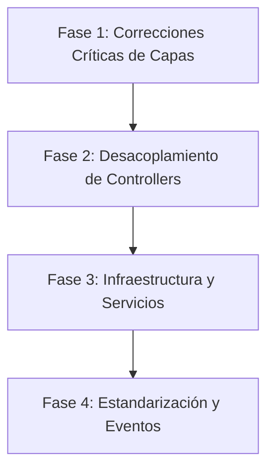

# Plan de Mejoras de Arquitectura — Tatelestai

Basado en el análisis de separación entre **Lógica de Negocio**, **Infraestructura** y **Presentación**, este documento detalla los problemas detectados y la lista de tareas priorizadas para llevar el backend a una arquitectura limpia, desacoplada y mantenible.

---

## Diagnóstico General

| Aspecto                         | Estado Actual                                    | Meta Arquitectónica                                |
| ------------------------------- | ------------------------------------------------ | -------------------------------------------------- |
| **Separación de Lógica**        | Gran parte en Actions (buen inicio)              | 100% de reglas de negocio en Actions/Dominio       |
| **Dirección de Dependencias**   | Algunas Actions dependen de Controllers          | Capa de Dominio totalmente aislada de la capa HTTP |
| **Entrada de Datos en Actions** | Algunas Actions reciben `Request $request`       | Actions reciben únicamente DTOs o tipos primitivos |
| **Autenticación en Actions**    | Uso de `Auth::id()` dentro de Actions            | `$userId` inyectado explícitamente como parámetro  |
| **Servicios Externos**          | Servicios acoplados a implementaciones concretas | Abstracción con Interfaces (Contracts)             |
| **Manejo de Errores**           | Mezcla de `Exception` genéricas y custom         | Excepciones de dominio tipadas y centralizadas     |
| **Efectos Secundarios**         | Emails síncronos dentro del flujo de la petición | Eventos de dominio + Listeners en cola (Queues)    |

---

## Lista de Tareas Priorizada



---

## FASE 1: Correcciones Críticas de Capas (Inversión de Dependencias)

Son errores que rompen el principio de responsabilidad única y acoplan el dominio a la infraestructura web.

### 1.1 Eliminar dependencia de Controllers dentro de `AddToCartAction`
- **Archivo:** `app/Actions/Cart/AddToCartAction.php`
- **Problema:** La Action inyecta `OfferController` y `CartController` en su constructor y llama a sus métodos (`$this->cartController->addOfferToCart()`, `$this->offerController->resolveOffer()`).
- **Impacto:** Una Action (capa de dominio) **nunca** debe depender de un Controller (capa HTTP).
- **Tareas:**
  - [ ] Crear o extraer `GetActiveCartAction` o `CartRepository` para obtener el carrito activo.
  - [ ] Mover la lógica de `CartController::addOfferToCart` a una Action dedicada (`AddOfferToCartAction`) o al repositorio.
  - [ ] Reemplazar las dependencias de Controllers por Actions/Repositories en `AddToCartAction`.

### 1.2 Desacoplar `CreateOfferAction` del objeto HTTP `Request`
- **Archivo:** `app/Actions/Offers/CreateOfferAction.php`
- **Problema:** El método `execute(Request $request)` recibe la clase `Illuminate\Http\Request` directamente.
- **Impacto:** La Action no puede reutilizarse en tests unitarios, comandos de Artisan o Jobs sin simular un request HTTP.
- **Tareas:**
  - [ ] Usar `CreateNewOfferDTO` o crear `CreateOfferDTO` con las propiedades validadas.
  - [ ] Cambiar la firma a: `public function execute(CreateOfferDTO $dto, int $userId): Offer`.
  - [ ] Hacer que el Controller instancie el DTO a partir del Request validado y se lo pase a la Action.

### 1.3 Eliminar el estado global `Auth::id()` de las Actions
- **Archivos:** `app/Actions/Cart/AddToCartAction.php`, `app/Actions/Offers/GetUserEstablishmentAction.php`
- **Problema:** Llamar a `Auth::id()` dentro de una Action la ata a la sesión HTTP del usuario actual.
- **Tareas:**
  - [ ] Pasar el `$userId` explícitamente como parámetro en los métodos `execute(...)`.
  - [ ] Que el Controller sea quien obtenga `Auth::id()` y lo suministre a la Action.

---

## FASE 2: Desacoplamiento y Limpieza de Controllers

Los Controllers deben ser "delgados" (*skinny controllers*): recibir peticiones, llamar a la Action y devolver una respuesta.

### 2.1 Refactorizar `CustomerSellController`
- **Archivo:** `app/Http/Controllers/CustomerSellController.php`
- **Tareas:**
  - [ ] **Método `historySell()`**:
    - Extraer el query y la lógica a `GetCustomerPurchaseHistoryAction`.
    - Crear `CustomerPurchaseHistoryResource` (API Resource) para formatear la respuesta JSON en lugar del `->map()` manual.
  - [ ] **Método `buyOffers()`**:
    - Mover la validación del token de sesión a una Action o middleware.
    - Encapsular la transacción completa y la orquestación en `ProcessCustomerPurchaseAction`.
  - [ ] **Método `prepareBuyOffers()`**:
    - Extraer la generación del token de preparación y expiración a un servicio o Action dedicada (`PreparePurchaseAction`).

### 2.2 Adoptar el Flujo Estándar en Todos los Endpoints
- **Flujo objetivo:**
  ```
  HTTP Request 
    -> Form Request (Validación de tipos y formatos)
    -> DTO (Datos fuertemente tipados)
    -> Action (Reglas de negocio y transacciones)
    -> API Resource (Transformación y serialización JSON)
    -> HTTP Response
  ```
- **Tareas:**
  - [ ] Crear Form Requests para endpoints que todavía usan `$request->validate([...])` inline.
  - [ ] Implementar Laravel API Resources (`JsonResource`) para respuestas de `Offer`, `Sell`, `FoodEstablishment` y `Report`.

---

## FASE 3: Infraestructura, Servicios Externos y Configuración

### 3.1 Corregir uso de `env()` en `GmailService`
- **Archivo:** `app/Services/GmailService.php`
- **Problema:** Usa `env('MAIL_USERNAME')` y `env('MAIL_PASSWORD')`. En producción con `config:cache`, las llamadas a `env()` devuelven `null`.
- **Tareas:**
  - [ ] Configurar las credenciales en `config/services.php` o usar la configuración nativa en `config/mail.php`.
  - [ ] Usar `config('services.gmail.username')` en lugar de `env()`.
  - [ ] *Opcional recomendado:* Evaluar usar el sistema nativo de Mailables y Notificaciones de Laravel en lugar de PHPMailer directo.

### 3.2 Crear Interfaces para Servicios Externos
- **Archivos:** `app/Services/GooglePlacesService.php`, `app/Services/GmailService.php`
- **Tareas:**
  - [ ] Crear `App\Contracts\PlacesServiceInterface` con métodos `searchPlaces`, `getPlaceDetails`, `autocomplete`.
  - [ ] Implementar `GooglePlacesService implements PlacesServiceInterface`.
  - [ ] Registrar el binding en `AppServiceProvider`:
    ```php
    $this->app->bind(PlacesServiceInterface::class, GooglePlacesService::class);
    ```
  - [ ] Inyectar la interfaz en lugar de la clase concreta para facilitar testing y mocks.

---

## FASE 4: Estandarización, Excepciones y Eventos de Dominio

### 4.1 Corregir Nombres de Archivos (PSR-12 / PascalCase)
- **Problema:** Existen Actions con nombre en camelCase en lugar de PascalCase.
- **Tareas:**
  - [ ] Renombrar `app/Actions/Sell/makeSellAction.php` -> `MakeSellAction.php`.
  - [ ] Renombrar `app/Actions/Sell/getCustomerSellsAction.php` -> `GetCustomerSellsAction.php`.
  - [ ] Renombrar `app/Actions/Sell/getSellerSellAction.php` -> `GetSellerSellAction.php`.
  - [ ] Actualizar imports y referencias en los controllers y tests.

### 4.2 Crear Excepciones de Dominio Específicas
- **Tareas:**
  - [ ] Crear clases de excepción bajo `app/Exceptions/`:
    - `InsufficientOfferStockException` (para stock insuficiente en la compra).
    - `OfferExpiredException` (para intentos de compra/agregado de ofertas expiradas).
    - `InvalidPurchaseTokenException` (para tokens de compra vencidos o inválidos).
    - `UnauthorizedProductAccessException` (productos que no pertenecen al vendedor).
  - [ ] Reemplazar los `throw new \Exception("mensaje en texto")` por las excepciones correspondientes.
  - [ ] Configurar el renderizado centralizado en `bootstrap/app.php` para mapear cada excepción a su código HTTP (400, 404, 409, 422).

### 4.3 Desacoplar Efectos Secundarios mediante Eventos
- **Tareas:**
  - [ ] Crear el evento `App\Events\PurchaseCompleted` con la información de la venta.
  - [ ] Crear el listener `App\Listeners\SendPurchaseConfirmationEmail` implementando `ShouldQueue`.
  - [ ] Disparar `event(new PurchaseCompleted($sell))` tras finalizar la transacción de compra en lugar de llamar a `Mail::to()` de forma síncrona.

---

## Resumen del Roadmap

| Fase | Dificultad | Impacto | Estado |
|---|---|---|---|
| **Fase 1: Correcciones Críticas de Capas** | Media | Alto (elimina acoplamiento grave) | Pendiente |
| **Fase 2: Desacoplamiento de Controllers** | Media | Medio-Alto (código limpio y testeable) | Pendiente |
| **Fase 3: Infraestructura y Servicios** | Baja | Medio (previene bugs en producción y mejora testing) | Pendiente |
| **Fase 4: Estandarización y Eventos** | Baja | Medio (consistencia y rendimiento) | Pendiente |
