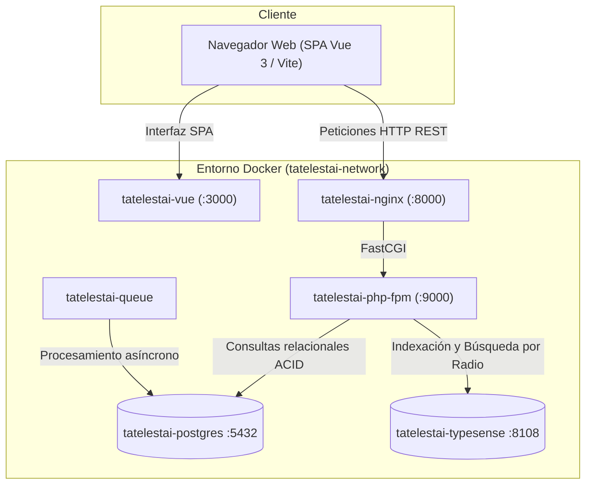

# Tatelestai

> Plataforma web de economía circular y reducción del desperdicio alimentario que conecta establecimientos gastronómicos con consumidores para la venta de excedentes de comida a precios accesibles.

[](https://php.net)
[](https://laravel.com)
[](https://vuejs.org)
[](https://www.postgresql.org/)
[](https://typesense.org/)
[](https://pestphp.com)
[](./docs/README.md)
[](LICENSE)

---

## Sobre el Proyecto

El desperdicio de alimentos es una de las mayores ineficiencias ecológicas y económicas globales. **Tatelestai** aborda este desafío mediante un marketplace donde:

*   **Compradores (Customers)**: Descubren ofertas de comida en buen estado a una fracción del precio comercial mediante geolocalización en tiempo real.
*   **Vendedores (Sellers)**: Comercios y restaurantes publican excedentes del día con control riguroso de inventario y franjas horarias de retiro.
*   **Administradores (Admins)**: Supervisan el ecosistema, validando y auditando comercios y ofertas para garantizar la seguridad del consumidor.

---

## Arquitectura en 1 Vistazo

El sistema desacopla el frontend reactivo de la API de backend, orquestando todos sus servicios mediante Docker:



### Contenedores y Servicios Docker

| Servicio Compose | Contenedor (`container_name`) | Puerto Host | Descripción |
|---|---|---|---|
| `nginx` | `tatelestai-nginx` | `8000` | Web server / Proxy inverso para Laravel API |
| `php-fpm` | `tatelestai-php-fpm` | - | Backend PHP 8.3 con Laravel 12 y extensiones |
| `queue` | `tatelestai-queue` | - | Procesador de trabajos en segundo plano (`queue:work`) |
| `vue` | `tatelestai-vue` | `3000` | Frontend SPA en Vue 3 con Vite (HMR) |
| `postgres` | `tatelestai-postgres` | `5432` | Base de datos relacional PostgreSQL 16 |
| `typesense` | `tatelestai-typesense` | `8108` | Motor de búsqueda instantánea y geocodificación |

> **Comandos sin depender de carpetas:** Al utilizar el nombre del contenedor (`docker exec -it tatelestai-php-fpm ...`), puedes ejecutar cualquier comando de Artisan, Composer o testing directamente desde **cualquier carpeta del proyecto o del sistema**, sin necesidad de ingresar a `docker-composes/tatelestai/`.

---

## Portal de Documentación (Framework Diátaxis)

La documentación técnica de este repositorio sigue formalmente el **[Framework Diátaxis](https://diataxis.fr/)**, clasificando el contenido en 4 cuadrantes según las necesidades del lector:

| Cuadrante | Propósito | Enlace al Portal |
|---|---|---|
| **Tutoriales** | Guiar paso a paso al recién llegado para lograr su primer despliegue funcional. | [Ver Tutoriales](./docs/tutorials/) |
| **Guías How-To** | Recetas concretas para resolver tareas comunes de desarrollo y testing. | [Ver Guías How-To](./docs/how-to/) |
| **Referencia** | Catálogo técnico de contratos, variables de entorno, servicios y puertos. | [Ver Referencia](./docs/reference/) |
| **Explicación & ADRs** | Fundamentación teórica, análisis de arquitectura, concurrencia y registros de decisión. | [Ver Explicación y ADRs](./docs/explanation/) |

> Puedes consultar el índice general en [docs/README.md](./docs/README.md).

---

## Quickstart (Puesta en marcha en 3 pasos)

Para comenzar a desarrollar rápidamente con Docker:

```bash
# 1. Configurar variables de entorno de Docker
cp docker-composes/tatelestai/.env.example docker-composes/tatelestai/.env

# 2. Levantar servicios en segundo plano
cd docker-composes/tatelestai
docker compose up -d --build

# 3. Inicializar base de datos y catálogo de búsqueda (desde cualquier carpeta)
docker exec -it tatelestai-php-fpm php artisan migrate --seed
```

> **Automatizaciones incluidas**: Al iniciar los contenedores, Docker aprovisiona automáticamente el `.env` del Backend (si no existe), instala dependencias (`composer install` y `npm install`), genera el `APP_KEY`, configura `storage:link` y sincroniza los permisos. El comando `migrate --seed` no solo migra y puebla la base de datos sino que también **indexa automáticamente las ofertas en Typesense**.

* **Frontend Web**: [http://localhost:3000](http://localhost:3000)
* **API Backend**: [http://localhost:8000/api](http://localhost:8000/api)
* **Typesense Health**: [http://localhost:8108/health](http://localhost:8108/health)

*(Para instrucciones detalladas paso a paso, consulta el [Tutorial de Onboarding](./docs/tutorials/01-onboarding-entorno-local.md)).*

---

## Pruebas Automatizadas

Puedes ejecutar las pruebas desde cualquier directorio usando el nombre del contenedor:

```bash
# Ejecutar suite de pruebas con Pest
docker exec -it tatelestai-php-fpm php artisan test

# Análisis y formateo con Laravel Pint
docker exec -it tatelestai-php-fpm ./vendor/bin/pint --test
```

*(Más opciones en la guía [Cómo ejecutar tests y calidad](./docs/how-to/ejecutar-tests-y-calidad.md)).*

---

## Estructura del Repositorio

```text
.
├── Backend/example-app/      # Backend API en Laravel 12 (Actions, DTOs, Enums)
├── Frontend/vue-project/     # Frontend SPA en Vue 3 + Vite 6 + Tailwind CSS 4
├── docs/                     # Sistema de documentación oficial (Diátaxis + Gobierno)
│   ├── tutorials/            # Tutoriales de aprendizaje
│   ├── how-to/               # Guías y recetas operativas
│   ├── reference/            # Especificaciones y contratos técnicos
│   ├── explanation/          # Arquitectura, teoría y ADRs
│   └── project/              # Roadmap, alcance MoSCoW y especificaciones funcionales
├── docker-composes/          # Orquestación de infraestructura de servicios (Postgres, Typesense, Nginx)
└── Proyecto Tatelestai/      # Vault y borrador original de notas (referencia histórica)
```

---

## Licencia

Este proyecto se distribuye bajo la Licencia MIT. Consulta el archivo `LICENSE` para más información.
