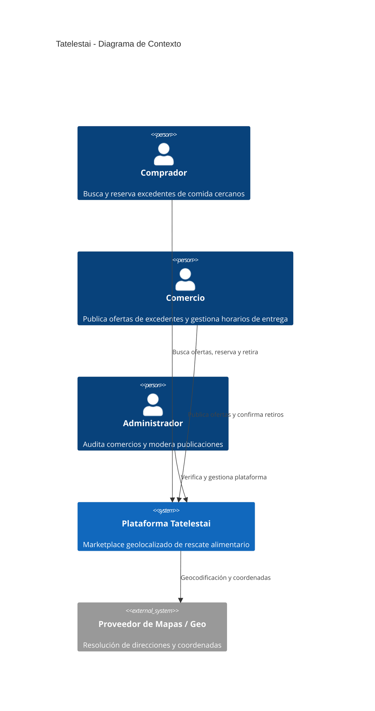

# Guía para una Documentación Profesional en Tatelestai

Esta guía establece los estándares, la estructura y las mejores prácticas para construir y mantener una documentación técnica de nivel profesional (producción / estándar de industria / defensa técnica) para el proyecto **Tatelestai**.

---

## 1. Principio Fundamental: *Documentation as Code (DaC)*

Para que la documentación no se vuelva obsoleta ni sea ignorada:
1. **Vive en el mismo repositorio Git** (`/docs` y `README.md`).
2. **Versionada junto al código**: Si un Pull Request modifica un endpoint, una variable de entorno o una regla de negocio, **debe actualizar su documentación en el mismo PR**.
3. **Diagramas como código (Mermaid.js)**: Evitar capturas de pantalla o imágenes estáticas para diagramas de arquitectura y flujos; usar sintaxis de Mermaid para que cualquier dev pueda modificarlos en texto plano.

---

## 2. El Framework Diátaxis (La columna vertebral)

Tatelestai ya cuenta con las bases del estándar **[Diátaxis](https://diataxis.fr/)**. Para mantener el nivel profesional, cada documento debe encajar estrictamente en uno de los 4 cuadrantes sin mezclar propósitos:

```
                            PRÁCTICA (Hacer)
                                  │
          1. TUTORIALES           │         2. GUÍAS HOW-TO
      (Orientado al aprendizaje)  │    (Orientado a resolver tareas)
                                  │
ADQUISICIÓN                       ┼───────────────────────── APLICACIÓN
(Primeros pasos)                  │                          (Día a día del dev)
                                  │
          4. EXPLICACIÓN          │         3. REFERENCIA
      (Orientado a entender)      │    (Orientado a la información pura)
                                  │
                            TEORÍA (Saber)
```

### Cuadrante 1: Tutoriales (`docs/tutorials/`)
* **Objetivo**: Guiar al principiante paso a paso para lograr una victoria rápida sin abrumarlo con teoría ni opciones alternativas.
* **Tono**: Pedagógico, lineal y prescriptivo ("Haz A, luego B, obtendrás C").
* **Qué debe haber aquí**:
  - `01-onboarding-entorno-local.md`: Clonar, `.env`, levantar Docker, migrar datos y ver la web funcionando en < 10 minutos.
  - `02-flujo-publicacion-y-reserva.md`: Paso a paso para crear un comercio, publicar una oferta con stock y reservarla como comprador.

### Cuadrante 2: Guías How-To / Recetas (`docs/how-to/`)
* **Objetivo**: Resolver un problema o tarea concreta de desarrollo. Responde a: *"¿Cómo hago X?"*.
* **Tono**: Práctico, directo, asume que el desarrollador ya conoce el sistema básico.
* **Qué debe haber aquí**:
  - `ejecutar-tests-y-calidad.md`: Cómo correr Pest, filtros por grupo y Pint.
  - `sincronizar-busqueda-typesense.md`: Cómo reindexar colecciones y probar geobúsqueda.
  - `crear-action-y-dto.md`: Pasos para implementar una nueva funcionalidad en Laravel siguiendo la arquitectura en capas.
  - `depurar-cola-de-trabajos.md`: Cómo inspeccionar jobs fallidos y workers de cola.

### Cuadrante 3: Referencia Técnica (`docs/reference/`)
* **Objetivo**: Describir la realidad técnica de forma estricta, exhaustiva y sin explicaciones filosóficas.
* **Tono**: Técnico, seco, preciso, consultivo (como un manual de especificaciones).
* **Qué debe haber aquí**:
  - `servicios-y-puertos.md`: Tabla de contenedores, puertos expuestos, nombres de servicio en Docker Network.
  - `variables-entorno.md`: Diccionario completo de variables `.env` (Frontend y Backend), propósito, tipo y valor por defecto.
  - `api-endpoints.md`: Contrato REST (o enlace a Swagger/OpenAPI). Códigos de respuesta HTTP, payloads y encabezados de autenticación.
  - `schema-base-de-datos.md`: Diccionario de tablas, claves foráneas, enums e índices.

### Cuadrante 4: Explicación y Arquitectura (`docs/explanation/`)
* **Objetivo**: Justificar el diseño, analizar el dominio y dar contexto conceptual. Responde a: *"¿Por qué está hecho así?"*.
* **Tono**: Discursivo, analítico, reflexivo.
* **Qué debe haber aquí**:
  - `arquitectura-y-capas.md`: Por qué se usan Actions y DTOs en lugar de Controladores sobrecargados.
  - `concurrencia-y-stock.md`: Explicación del problema de sobreventa (*overselling*) y justificación de *Pessimistic Locking* (`lockForUpdate`).
  - `maquinas-de-estado.md`: Ciclo de vida de comercios (`Pending -> Approved -> Rejected`) y de órdenes (`Created -> Reserved -> Claimed -> Expired`).
  - `busqueda-geografica.md`: Funcionamiento de la indexación geográfica (coordenadas lat/lng) y filtrado por radio en Typesense.
  - `adrs/` (Architecture Decision Records): Registro inmutable de decisiones clave tomadas (ej. ADR-001: Adopción de Typesense frente a Elasticsearch).

---

## 3. Estructura y Elementos del `README.md` Principal

El `README.md` de la raíz es la carta de presentación de Tatelestai. Debe responder en menos de 60 segundos:
1. **¿Qué problema resuelve este proyecto?** (Elevator Pitch: reducción del desperdicio de comida, economía circular).
2. **¿Qué tecnologías usa?** (Badges claros: Laravel 12, Vue 3, Typesense, PostgreSQL, Docker).
3. **¿Cómo se ve la arquitectura a alto nivel?** (Diagrama de bloques de comunicación Browser -> Nginx -> PHP-FPM -> DB/Typesense).
4. **¿Cómo lo levanto en local en 3 comandos?** (Quickstart reproducible sin fricción).
5. **¿Cómo ejecuto las pruebas?** (`docker exec -it tatelestai-php-fpm php artisan test`).
6. **¿Dónde leo más?** (Tabla con enlaces directos a la documentación Diátaxis).

---

## 4. Documentación de Arquitectura con el Modelo C4

Para documentar la arquitectura de software de forma clara, se recomienda usar el **Modelo C4** (utilizando diagramas Mermaid):

### Nivel 1: Diagrama de Contexto del Sistema
Muestra quiénes son los usuarios y los sistemas externos que interactúan con Tatelestai:



### Nivel 2: Diagrama de Contenedores
Muestra cómo se comunican los contenedores de Docker (Vue SPA, Nginx, PHP-FPM, PostgreSQL, Typesense, Queue Worker).

### Nivel 3: Diagrama de Componentes (Backend Laravel)
Muestra el flujo de una petición: `Route -> FormRequest -> Controller -> Action -> DTO -> Repository/Model -> Database`.

---

## 5. Documentación de API: El Estándar OpenAPI

Documentar endpoints manualmente en Markdown tiende a desactualizarse rápido. Para un estándar profesional:

1. **Especificación OpenAPI (v3.0 / v3.1)**:
   - Mantener un archivo `openapi.yaml` o generarlo automáticamente mediante herramientas del ecosistema Laravel como **Scribe** (`knuckleswtf/scribe`) o **L5-Swagger**.
2. **Lo que cada endpoint debe declarar obligatoriamente**:
   - Método HTTP y URI (ej: `POST /api/v1/offers/{offer}/reserve`).
   - Requisitos de Autenticación (Bearer Token Sanctum, roles permitidos: `customer`, `seller`, `admin`).
   - Esquema del Body / Parámetros (con tipos de datos, restricciones y campos obligatorios).
   - Respuestas documentadas:
     - `200 OK` / `201 Created` con payload de ejemplo.
     - `422 Unprocessable Entity` (errores de validación con formato consistente).
     - `401 Unauthorized` / `403 Forbidden`.
     - `409 Conflict` (ejemplo: stock agotado o reserva duplicada).
     - `404 Not Found`.

---

## 6. Documentación del Modelo de Datos (PostgreSQL)

Para documentar la persistencia de datos:
1. **Diagrama Entidad-Relación (DER)**: Generado en Mermaid con las relaciones principales:
   - `users` (1) ──── (0..1) `sellers`
   - `sellers` (1) ──── (0..*) `offers`
   - `offers` (1) ──── (0..*) `orders`
   - `users` (1) ──── (0..*) `orders`
2. **Diccionario de Datos**:
   - Explicar columnas no triviales (ej. campos de geolocalización `latitude`, `longitude`, campos monetarios almacenados en centavos/enteros para evitar imprecisiones de coma flotante, estados enums).
   - Políticas de borrado lógico (`softDeletes`) y claves foráneas con reglas `ON DELETE CASCADE` o `RESTRICT`.

---

## 7. Registro de Decisiones de Arquitectura (ADRs)

Los ADRs (*Architecture Decision Records*) evitan la pérdida de conocimiento histórico cuando el equipo cambia o cuando se defiende el proyecto.

### Plantilla de ADR (`docs/explanation/adrs/ADR-XXXX-nombre.md`)
```markdown
# ADR-001: Uso de Typesense para Búsqueda y Filtrado Geoespacial

## Estado
Aceptado (Fecha: 2026-03-01)

## Contexto
Tatelestai requiere que los usuarios encuentren ofertas activas dentro de un radio en kilómetros a su alrededor, con tiempos de respuesta menores a 50ms y filtros combinados (categoría, precio, hora de retiro). Evaluar PostgreSQL puro (PostGIS) vs Elasticsearch vs Typesense.

## Decisión
Se decide implementar Typesense a través de Laravel Scout.
- Facilidad de despliegue en contenedor Docker liviano (< 50MB RAM).
- Soporte nativo para coordenadas geográficas y ordenamiento por proximidad.
- Búsqueda "typo-tolerant" para nombres de locales y comidas.

## Consecuencias
* Positivas: Rendimiento instantáneo de búsqueda geolocalizada sin sobrecargar PostgreSQL.
* Negativas / Riesgos: Necesidad de sincronizar índices en eventos de creación/edición de ofertas y mantener un contenedor adicional.
```

---

## 8. Guía de Contribución y Calidad (`CONTRIBUTING.md`)

Para que el proyecto luzca profesional ante terceros o colaboradores, debe existir una guía de contribución con:
1. **Convención de Git Commits**:
   - Uso de Conventional Commits (`feat:`, `fix:`, `docs:`, `refactor:`, `test:`).
2. **Convenciones de Código**:
   - Backend: Laravel Pint (PSR-12).
   - Frontend: ESLint + Prettier.
3. **Checklist antes de abrir un Pull Request**:
   - [ ] Todos los tests de Pest pasan (`php artisan test`).
   - [ ] El código está formateado (`vendor/bin/pint`).
   - [ ] La documentación fue actualizada si hubo cambios de API o configuración.

---

## 9. Lista de Verificación (Checklist) para Tatelestai

Utiliza esta lista para auditar la documentación actual del proyecto:

- [x] **README.md en raíz**: Claramente estructurado con descripción, badges, Quickstart y arquitectura general.
- [x] **Estructura Diátaxis creada**: Directorios `tutorials/`, `how-to/`, `reference/`, `explanation/`.
- [x] **Guía de Onboarding Local**: Creada en `tutorials/01-onboarding-entorno-local.md`.
- [x] **Explicación de Concurrencia**: Creada en `explanation/concurrencia-y-stock.md`.
- [x] **Consolidación de notas de Obsidian**: Migración integral de la lógica de negocio, arquitectura y alcance desde `/Proyecto Tatelestai` hacia `/docs` completada.
- [ ] **Especificación de API (OpenAPI/Swagger)**: Generar contrato formal de endpoints para sellers, offers y orders.
- [ ] **Diagrama DER de PostgreSQL**: Agregar diagrama y diccionario de datos en `reference/schema-base-de-datos.md`.
- [ ] **Guía de Despliegue en Producción (Docker/Cloud)**: Crear How-To sobre cómo llevar el entorno a un servidor productivo (certificados SSL, Nginx producción, variables seguras).
