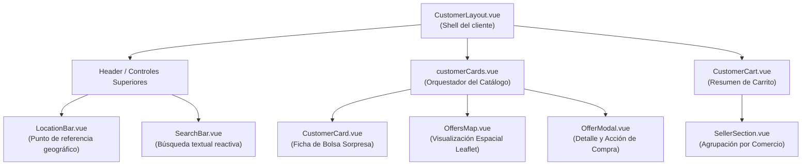

# Explicación: Experiencia del Cliente y Catálogo de Bolsas Sorpresa

> **Tipo**: Explicación / Arquitectura de Frontend (Diátaxis)  
> **Objetivo**: Explicar la arquitectura de componentes, las decisiones de UX/UI, los flujos de interacción del cliente y la generación de datos de prueba para el marketplace de bolsas sorpresa (*Surprise Bags*) en Tatelestai.  
> **Documentos Relacionados**: [Lógica de Negocio de Packs Sorpresa](./logica-negocio-packs-sorpresa.md) · [ADR-0004: Transición al Modelo de Bolsas Sorpresa](./adrs/0004-transicion-a-modelo-bolsas-sorpresa.md) · [Sistema de Diseño UI/UX](../../DESIGN.md) · [Tareas de Búsqueda Geolocalizada](../project/tareas-geolocalizacion.md)

---

## 1. Propósito y Contexto

La transición de Tatelestai desde un catálogo tradicional de productos individuales hacia el modelo de **bolsas sorpresa** (inspirado en plataformas de economía circular como *Too Good To Go*) requiere una redefinición completa de la experiencia del consumidor:

1. **De la búsqueda de artículos específicos al descubrimiento por proximidad**: El comprador ya no busca "leche descremada" o "empanadas de carne", sino que descubre comercios barriales cercanos que ofrecen paquetes de alimentos en riesgo de desperdicio.
2. **Propuesta de valor clara**: Cada tarjeta y modal destaca el **ahorro monetario garantizado** (comparando el precio a pagar contra el valor original de lista), el **peso estimado en kg** de comida rescatada y la **franja horaria estricta de retiro** (*pick-up window*).
3. **Reducción de incertidumbre**: Aunque el contenido exacto de la bolsa varía día a día según el excedente real, la interfaz comunica de forma prominente la **categoría gastronómica**, los **alérgenos declarados** y la reputación/ubicación del local.

---

## 2. Mapa de Componentes Frontend (Vue 3)

La experiencia del cliente se organiza en torno a un conjunto de componentes reutilizables y reactivos ubicados en `Frontend/vue-project/src/components/`:



### Responsabilidades por Componente

| Componente | Archivo | Responsabilidad Principal |
|---|---|---|
| **Catálogo de Ofertas** | [`customerCards.vue`](file:///home/lucas/Documentos/Tatelestai/Frontend/vue-project/src/components/layouts/customer/customerCards.vue) | Orquesta el catálogo general, gestiona la conmutación entre vista de lista y vista de mapa, filtra por categorías temáticas, aplica ordenamientos y calcula distancias reactivas con el store de ubicación. |
| **Tarjeta de Pack** | [`CustomerCard.vue`](file:///home/lucas/Documentos/Tatelestai/Frontend/vue-project/src/components/layouts/customer/CustomerCard.vue) | Representa la ficha individual de una bolsa sorpresa con estética *Dark Violet & Plum*, badge de cupos con semáforo de urgencia, temporizador flotante dinámico, alérgenos y microinteracción de agregado rápido. |
| **Modal de Detalle** | [`OfferModal.vue`](file:///home/lucas/Documentos/Tatelestai/Frontend/vue-project/src/components/common/OfferModal.vue) | Diálogo emergente con desglose ampliado del pack: valor de lista original, porcentaje de descuento, horario de retiro, alérgenos, peso estimado, navegación a la vista del comercio y selector de cantidad con límite de stock. |
| **Mapa Espacial** | [`OffersMap.vue`](file:///home/lucas/Documentos/Tatelestai/Frontend/vue-project/src/components/common/OffersMap.vue) | Renderiza el mapa interactivo (Leaflet/OpenStreetMap), consumiendo el endpoint `/packs`, agrupando comercios por coordenadas geográficas y mostrando popups con precios bonificados. |
| **Barra de Ubicación** | [`LocationBar.vue`](file:///home/lucas/Documentos/Tatelestai/Frontend/vue-project/src/components/common/LocationBar.vue) | Botón tipo píldora que despliega un popover para seleccionar o resetear la ubicación de referencia del usuario, adaptado a la paleta Dark Violet. |
| **Barra de Búsqueda** | [`SearchBar.vue`](file:///home/lucas/Documentos/Tatelestai/Frontend/vue-project/src/components/common/SearchBar.vue) | Campo de texto accesible con debounce, botón de limpieza rápida e integración con los filtros del catálogo. |
| **Carrito del Cliente** | [`CustomerCart.vue`](file:///home/lucas/Documentos/Tatelestai/Frontend/vue-project/src/components/layouts/customer/CustomerCart.vue) | Vista de resumen de reservas pendientes agrupadas por comercio, cálculo reactivo del total de ítems y gestión de errores/estados vacíos. |
| **Sección por Comercio en Carrito** | [`SellerSection.vue`](file:///home/lucas/Documentos/Tatelestai/Frontend/vue-project/src/components/layouts/customer/SellerSection.vue) | Subcomponente del carrito que agrupa las bolsas reservadas por establecimiento, validando stock disponible, horarios de retiro y permitiendo modificar cantidades o vaciar el grupo. |
| **Ficha de Establecimiento** | [`EstablishmentView.vue`](file:///home/lucas/Documentos/Tatelestai/Frontend/vue-project/src/components/layouts/customer/EstablishmentView.vue) | Página dedicada al comercio que muestra sus datos de contacto y la lista de packs sorpresa activos utilizando el endpoint unificado `/packs`. |

---

## 3. Catálogo y Navegación Dual (`customerCards.vue`)

El componente [`customerCards.vue`](file:///home/lucas/Documentos/Tatelestai/Frontend/vue-project/src/components/layouts/customer/customerCards.vue) funciona como el panel central del cliente, integrando múltiples criterios de exploración:

### 3.1. Vista Conmutable: Lista vs. Mapa
El usuario puede alternar entre dos modos de visualización sin perder su estado de filtrado:
- **Modo Lista (`viewMode = 'list'`)**: Grilla responsiva de tarjetas [`CustomerCard.vue`](file:///home/lucas/Documentos/Tatelestai/Frontend/vue-project/src/components/layouts/customer/CustomerCard.vue) diseñada para un escaneo visual rápido.
- **Modo Mapa (`viewMode = 'map'`)**: Componente [`OffersMap.vue`](file:///home/lucas/Documentos/Tatelestai/Frontend/vue-project/src/components/common/OffersMap.vue) que sitúa los comercios en el mapa con marcadores georreferenciados.

### 3.2. Categorías Temáticas Rápidas
Se incorporan filtros tipo *chips* para segmentar ofertas según la ocasión de rescate:
* **Todas**: Muestra la totalidad de ofertas disponibles.
* **Bolsas Sorpresa**: Packs generales de excedente mixto.
* **Panaderías**: Panificados, masas madre y facturas.
* **Platos del Día**: Viandas caseras, pastas, pizzas y comidas preparadas al mediodía/noche.
* **Vegano**: Opciones 100% plant-based y bowls saludables.
* **Pastelería**: Dulces, tartas, alfajores y cafetería.

### 3.3. Ordenamiento Multidimensional
El desplegable de ordenamiento adapta el catálogo a las preferencias del usuario:
1. **Por distancia (`sortBy = 'distance'`)**: Prioriza los locales más cercanos calculando la distancia Haversine en kilómetros respecto al punto activo en `locationStore`.
2. **Mayor descuento (`sortBy = 'discount'`)**: Ordena de forma descendente por el porcentaje de ahorro `((minimum_value - price) / minimum_value) * 100`.
3. **Menor precio (`sortBy = 'price_asc'`)**: Facilita encontrar los packs más económicos.
4. **Mayor precio (`sortBy = 'price_desc'`)**: Permite descubrir canastas grandes o packs de alto volumen.

---

## 4. Ficha de Bolsa Sorpresa (`CustomerCard.vue`)

El componente [`CustomerCard.vue`](file:///home/lucas/Documentos/Tatelestai/Frontend/vue-project/src/components/layouts/customer/CustomerCard.vue) implementa fielmente el sistema de diseño **Dark Violet & Plum** definido en [`DESIGN.md`](file:///home/lucas/Documentos/Tatelestai/DESIGN.md):

### Elementos Visuales Clave
1. **Banner Hero y Gradientes Contextuales**: Cada tarjeta cuenta con un contenedor superior con relación de aspecto 16:9 que incluye un gradiente temático según la categoría y badges flotantes.
2. **Píldora de Descuento (`Savings Pill`)**: Destaca el porcentaje de descuento en color verde esmeralda (`#10B981`) con texto en alto contraste.
3. **Semáforo de Cupos Restantes**:
   - `1 disponible`: Punto rojo intermitente (`#EF4444`) indicando última oportunidad.
   - `2 a 3 disponibles`: Punto ámbar (`#F59E0B`) advirtiendo stock limitado.
   - `> 3 disponibles`: Punto esmeralda (`#10B981`) indicando disponibilidad normal.
4. **Temporizador Flotante Dinámico (`timeCountdown`)**:
   - Calcula el tiempo restante hasta la franja de retiro o el cierre del turno.
   - **Estado Crítico (< 30 min)**: Fondo rojizo con borde `#EF4444/40` y animación `animate-pulse`.
   - **Estado Urgente (< 2 horas)**: Fondo ámbar con borde `#F59E0B/40`.
   - **Estado Regular**: Fondo violeta oscuro con borde neutral `#3D3450`.
5. **Horario de Retiro Prominente**: Barra con ícono de reloj indicando la ventana exacta (ej. *"19:30 - 20:30 hs"*).
6. **Microinteracción de Compra Rápida**: Al pulsar el botón "Comprar", este conmuta temporalmente a color verde esmeralda con ícono de tilde rebotando y el texto *"¡Agregado!"*, brindando certeza visual sin interrumpir la exploración.

---

## 5. Modal de Oferta y Adaptación Híbrida (`OfferModal.vue`)

El componente [`OfferModal.vue`](file:///home/lucas/Documentos/Tatelestai/Frontend/vue-project/src/components/common/OfferModal.vue) unifica la experiencia de compra tanto para ofertas de packs sorpresa como para ofertas históricas con desglose de productos:

* **Packs Sorpresa (sin productos individuales)**: Muestra una caja informativa con el precio de lista tachado vs. precio de oferta, badge de ahorro porcentual, horario de retiro, peso estimado en kg y chips con advertencias de alérgenos.
* **Ofertas con Productos (retrocompatibilidad)**: Mantiene el desglose de productos unitarios con sus respectivas cantidades si existieran en la base de datos.
* **Navegación al Comercio**: Permite saltar directamente a la vista del establecimiento gastronómico mediante `goToEstablishment()`.
* **Control de Stock Reactivo**: El campo de cantidad limita automáticamente el valor máximo permitido al stock restante de la oferta (`:max="availableQuantity"`).

---

## 6. Carrito Adaptado a Packs (`CustomerCart.vue` & `SellerSection.vue`)

La gestión del carrito en el frontend fue refactorizada para adaptarse al flujo de bolsas sorpresa:

1. **Eliminación de la dependencia de productos individuales**: El componente [`SellerSection.vue`](file:///home/lucas/Documentos/Tatelestai/Frontend/vue-project/src/components/layouts/customer/SellerSection.vue) ahora puede renderizar ofertas de pack directamente leyendo `offer.price`, `offer.minimum_value`, `offer.pickup_start_datetime` y `offer.expiration_datetime`, sin requerir un array `offer.products`.
2. **Corrección de Endpoint de Eliminación**: Se corrigió el método `handleRemoveOffer` para invocar `DELETE /customer-cart/{offerId}` utilizando el identificador real de la oferta (`offer_id`).
3. **Resumen y Conteos Reactivos**: Se implementó la propiedad computada `totalItemsCount` en [`CustomerCart.vue`](file:///home/lucas/Documentos/Tatelestai/Frontend/vue-project/src/components/layouts/customer/CustomerCart.vue) para calcular la cantidad total de bolsas reservadas en todos los comercios del carrito.

---

## 7. Protección de Rutas (`customer-routes.js`)

En [`customer-routes.js`](file:///home/lucas/Documentos/Tatelestai/Frontend/vue-project/src/router/modules/customer-routes.js), se blindaron las rutas sensibles del módulo de clientes agregando metadatos de autorización:

```javascript
meta: {
  requiresAuth: true,
  requiresCustomer: true,
}
```

Esto asegura que tanto la vista del carrito (`cart`) como el historial de compras (`customer-purchases`) requieran que el usuario esté autenticado con el rol correspondiente, redirigiendo al login en caso contrario.

---

## 8. Seeders de Datos y Población de Demostración

Para posibilitar el desarrollo continuo, pruebas visuales y demostraciones académicas del nuevo catálogo, se optimizaron dos seeders en el backend:

### 8.1. `PackTemplateSeeder.php`
Genera un abanico completo de plantillas representativas categorizadas por tipo de establecimiento gastronómico:
* **Restaurantes / Pizzerías (Tipo 1)**: Viandas caseras nocturnas, almuerzos ejecutivos, pizza boxes artesanales y bowls veganos con alérgenos (gluten, lácteos, huevo, frutos secos, soja) y pesos entre 1.10 kg y 1.50 kg.
* **Cafeterías / Panaderías / Pastelerías (Tipo 2)**: Bolsas sorpresa de panadería artesanal, sweet boxes de repostería, packs de merienda con medialunas/croissants y opciones saludables veganas.
* **Supermercados / Almacenes / Dietéticas (Tipo 3)**: Canastas de rescate de huerta/frutas (hasta 3.20 kg), packs de almacén y lácteos de fecha cercana, y bolsas de panificados de supermercado.

### 8.2. `PackOfferSeeder.php`
* Asocia las plantillas anteriores a los comercios registrados.
* Asigna precios promocionales y valores mínimos garantizados con descuentos del 50% al 65%.
* Genera ventanas horarias de retiro realistas (`now()->addMinutes(...)` a `now()->addHours(...)`).
* Inserta tanto **ofertas activas** con cupos disponibles (1 a 5 unidades) como **ofertas históricas/compradas** (`PURCHASED`) con stock en 0 para enriquecer las métricas del panel de control.
