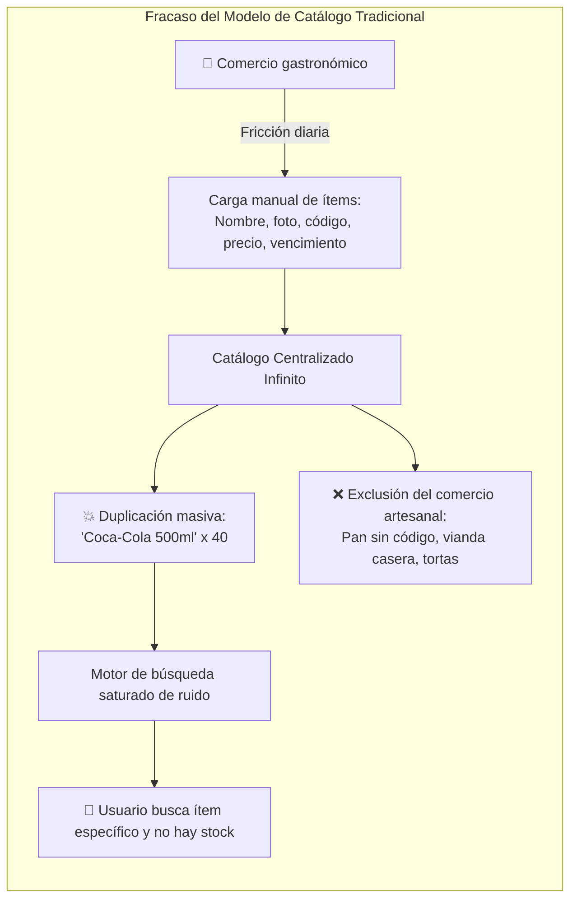
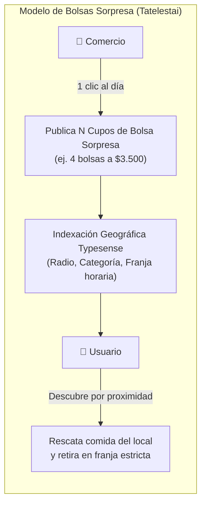
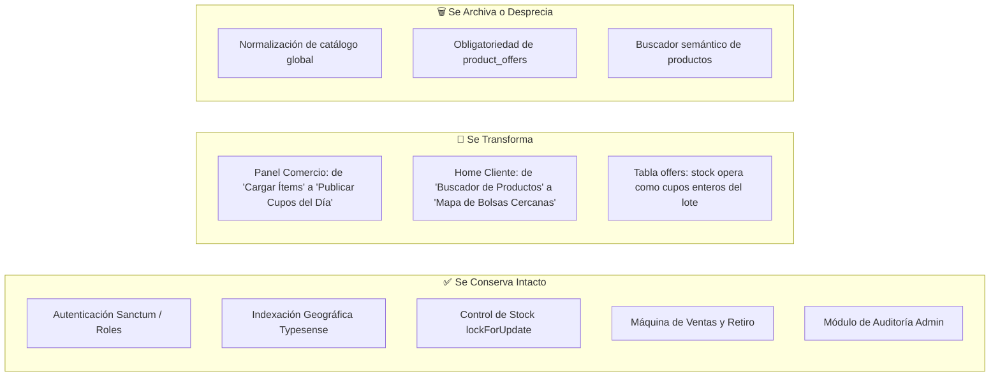

# Explicación: Justificación del Cambio de Modelo — De Catálogo a Bolsas Sorpresa

> **Tipo**: Explicación / Arquitectura y Estrategia de Producto (Diátaxis)  
> **Objetivo**: Justificar técnica, funcional y operativamente la transición desde un catálogo global de productos hacia un modelo de bolsas sorpresa con cupos diarios en Tatelestai, evaluando compensaciones (*trade-offs*), impacto en comercios locales y simplificación arquitectónica.  
> **Documentos Relacionados**: [Lógica de Negocio de Packs Sorpresa](./logica-negocio-packs-sorpresa.md) · [ADR-0004: Transición al Modelo de Bolsas Sorpresa](./adrs/0004-transicion-a-modelo-bolsas-sorpresa.md) · [Motor de Búsqueda y Adaptador Typesense](./busqueda-patron-adaptador.md)

---

## 1. Resumen Ejecutivo

La versión inicial de Tatelestai fue concebida bajo la inercia de un marketplace e-commerce tradicional: los comercios registraban artículos individuales en un catálogo, los usuarios exploraban productos específicos y armaban carritos ítem por ítem.

A medida que el proyecto evolucionó y se contrastó con la dinámica real del desperdicio alimentario, este esquema evidenció **problemas estructurales insalvables**. No se trataba de dificultades corregibles con más código o mejores algoritmos, sino de una inadecuación radical entre el modelo de datos y la realidad del negocio.

La decisión estratégica consiste en abandonar el catálogo granular de productos y migrar formalmente al modelo de **bolsas sorpresa (*Surprise Bags*) con cupos diarios**, popularizado con éxito mundial por plataformas como *Too Good To Go*. Este documento expone los motivos que vuelven inviable el modelo de catálogo, los fundamentos de escalabilidad del nuevo enfoque y el análisis transparente de costos y beneficios.

---

## 2. El Modelo Anterior y sus Problemas Estructurales

### 2.1. ¿Qué se intentaba hacer?

* Los comercios daban de alta productos unitarios con atributos descriptivos (título, marca, categoría, precio de lista, imagen y descripción).
* La plataforma intentaba mantener un catálogo global estandarizado para reutilizar productos entre diferentes locales.
* El usuario buscaba artículos específicos mediante motores de búsqueda de texto completo y agregaba unidades al carrito.

### 2.2. Patologías Identificadas

#### a) La imposibilidad ontológica del catálogo global
No existe forma de mantener un catálogo exhaustivo y homogéneo para la gastronomía minorista. Cada rotisería, confitería o panadería elabora productos con nombres propios, gramajes particulares y recetas variables. La base de datos crecía en dispersión sin alcanzar jamás completitud ni consistencia.

#### b) Duplicidad endémica
Distintos establecimientos registraban el mismo artículo con sutiles diferencias sintácticas (*"Empanada de Carne"*, *"Empanada criolla de carne cortada a cuchillo"*, *"Empanada carne x un"*). La normalización automática requería heurísticas complejas o moderación manual intensiva que consumía recursos sin aportar valor real.

#### c) Desvío del foco tecnológico hacia la búsqueda de texto
Para ofrecer una búsqueda tolerable sobre un catálogo desordenado, se requería un motor con ponderaciones semánticas, tolerancia a erratas tipográficas, sinónimos y lematización. Construir un motor de búsqueda tipo *Amazon* desviaba al equipo del propósito central de la plataforma: **conectar excedente inmediato con rescatistas cercanos**.

#### d) Exclusión involuntaria del comercio artesanal y de proximidad
Los establecimientos que mayor volumen de merma alimentaria generan son los pequeños negocios barriales: panaderías familiares, casas de comidas caseras y reposterías. Sus productos no poseen código EAN/UPC, tablas nutricionales estandarizadas ni envasado de fábrica. El modelo de catálogo imponía una barrera de entrada insalvable para este segmento.

#### e) Fricción operativa inaceptable para el comerciante
El dueño o empleado de un local gastronómico no cuenta con tiempo libre al concluir el servicio para catalogar digitalmente las 3 porciones de lasagna o las 5 medialunas remanentes. Cualquier herramienta que demande más de 1 a 2 minutos diarios resulta abandonada.

#### f) Competencia asimétrica y errónea
Intentar vender productos unitarios transformaba a Tatelestai en un clon deficiente de aplicaciones de *quick-commerce* (Rappi, PedidosYa). En esa arena no existía ventaja competitiva defendible.

---

## 3. El Modelo Propuesto: Bolsas Sorpresa con Cupos Diarios

### 3.1. Simplificación Radical del Dominio

* **Cero catálogo de ítems**: El comercio no da de alta productos individuales.
* **Venta de cupos**: El local publica una cantidad entera de bolsas sorpresa para el turno (ej. *"Hoy me sobran 5 bolsas"*), con un precio rebajado, un valor original mínimo garantizado, declaración de alérgenos y una ventana horaria estricta de retiro.
* **El usuario rescata establecimientos, no ítems**: El comprador elige rescatar la propuesta gastronómica de un local de su barrio, aceptando que el contenido exacto dependerá de los excedentes del día.
* **Búsqueda geográfica pura**: Se elimina la búsqueda de productos y se prioriza la búsqueda espacial (`_geoloc`) por distancia, franja de retiro y rubro.

### 3.2. Las Dos Entidades que Reemplazan al Catálogo

Toda la complejidad relacional previa se sustituye por dos componentes compactos y predecibles:

1. **Rubros Comerciales Fijos**: Un enum cerrado administrado por el sistema (`bakery`, `restaurant`, `sushi`, `cafe`, `greengrocer`, `pastas`).
2. **Plantillas de Packs (`PackTemplate`)**: 1 o 2 configuraciones base por comercio (ej. *"Pack Mediodía - Vianda Sorpresa"*, *"Bolsa Panadería y Facturas"*), con descripción breve, alérgenos, precio, valor mínimo y franja horaria estándar.

---

## 4. Análisis Comparativo y Ventajas Técnicas

```mermaid
flowchart TD
    subgraph OldComparison["Antes: Catálogo de Productos"]
        O1[Carga de ítems unitarios] --> O2[Normalización y deduplicación]
        O2 --> O3[Sincronización de stock por ítem]
        O3 --> O4[Buscador semántico global]
        O4 --> O5[Riesgo legal: vencimientos individuales]
    end

    subgraph NewComparison["Ahora: Bolsas Sorpresa"]
        N1[Plantillas base reutilizables] --> N2[Cupo entero por franja horaria]
        N2 --> N3[Pessimistic Locking sobre cupos]
        N3 --> N4[Geobúsqueda por proximidad y rubro]
        N4 --> N5[Marco legal acotado: alérgenos declarados]
    end
```

| Criterio | Modelo Anterior (Catálogo) | Modelo Nuevo (Bolsas Sorpresa) | Beneficio para Tatelestai |
|---|---|---|---|
| **Tiempo de publicación para el comercio** | 15 a 30 minutos diarios | Menos de 60 segundos | Retención y recurrencia de comerciantes |
| **Complejidad de base de datos** | Tablas de productos, marcas, variantes, categorías | Ofertas con cupo entero y plantillas | Esquema relacional limpio y de alto rendimiento |
| **Motor de búsqueda** | Requería procesamiento NLP y fuzzy matching sobre miles de títulos | Búsqueda geográfica y facetas por rubro en Typesense | Consultas instantáneas (< 5ms) y menor costo de hardware |
| **Inclusión de comercios** | Solo comercios con productos envasados o industrializados | 100% de la gastronomía barrial y artesanal | Aumento masivo de oferta disponible |
| **Riesgo legal y rotulado** | Exigencia de detallar lotes y fechas por producto | Rotulado de alérgenos a nivel bolsa con retiro en mano | Superficie de riesgo jurídico mínima |

---

## 5. Trade-Offs: ¿Qué se Sacrifica y Cómo se Mitiga?

Un cambio arquitectónico honesto debe ponderar las pérdidas funcionales:

| Pérdida Funcional | Impacto Real | Estrategia de Mitigación en Tatelestai |
|---|---|---|
| **El usuario no elige el alimento puntual** | Algunos compradores buscan un producto exacto (ej. "sandwiches de miga"). | El beneficio del 60-70% de descuento y la garantía de valor mínimo compensan la incertidumbre. Quien desea elegir paga carta regular. |
| **Imposibilidad de buscar por ingrediente puntual** | No se puede buscar "pan de centeno". | Filtros exhaustivos por categorías gastronómicas y restricciones alimentarias (vegano, celíaco). |
| **Sin integración con sistemas POS / ERP del local** | Locales con software de stock no sincronizan artículos. | Al no requerir stock individual, no se necesita integración alguna. El comercio sólo asigna cupos de merma. |
| **Reseñas no asociadas a un producto** | No se califica "el alfajor", sino la experiencia general. | Las reseñas evalúan la generosidad de la bolsa, la puntualidad del local y la calidad bromatológica percibida. |

> [!TIP]
> Ninguno de los elementos sacrificados forma parte del valor nuclear de una plataforma de rescate alimentario: **liquidar excedentes antes de su descarte de forma ultra-rápida y sin fricción**.

---

## 6. Casos de Uso Concretos: Antes vs. Ahora

| Escenario Gastronómico | Comportamiento en Modelo Anterior | Comportamiento en Modelo Nuevo |
|---|---|---|
| **Panadería tradicional**: Sobran 1 kg de pan francés y 6 facturas surtidas. | Imposible de cargar: ¿Se publican 6 facturas individuales o 1 kg fraccionado? El comercio no lo hacía. | Se publica 1 cupo de *"Bolsa Sorpresa Panadería"* a $2.500 (valor regular $7.500). Creado en 20 segundos. |
| **Rotisería**: Quedan 2 porciones de pastel de papa y 1 tarta de verduras. | Requería crear productos sin código ni foto atractiva. | Va dentro de la *"Vianda Sorpresa Noche"*. El cliente sabe que recibe comida casera del día. |
| **Cafetería de especialidad**: Merma de pastelería artesanal del día. | La variedad cambiaba a diario; actualizar el menú digital requería rehacer el catálogo. | Se utiliza la plantilla *"Sweet Box Sorpresa"*. El contenido varía libremente sin alterar el sistema. |

---

## 7. Plan de Reutilización del Código Existente

No se descarta el desarrollo realizado; se reorienta estratégicamente la base de código de Laravel y Vue:

---

## 8. Regla de Arquitectura para el Futuro

> [!IMPORTANT]
> **Principio de Diseño Inmutable**: Si una propuesta funcional exige modelar un catálogo global exhaustivo de elementos que la plataforma no controla ni fabrica directamente, **no se construye**.

Tatelestai resuelve un problema logístico y transaccional: **rescatar alimentos en ventanas críticas de tiempo**. Todo mecanismo que introduzca fricción entre el excedente del comerciante y el comprador atenta contra la viabilidad del proyecto.

---

**Nota:** Este documento sustenta formalmente la decisión de producto y arquitectura. Complementa a [logica-negocio-packs-sorpresa.md](./logica-negocio-packs-sorpresa.md) y se formaliza en el registro [ADR-0004: Transición al Modelo de Bolsas Sorpresa](./adrs/0004-transicion-a-modelo-bolsas-sorpresa.md).
