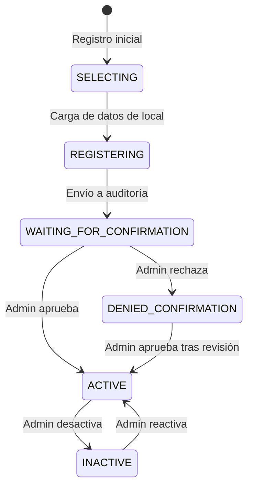
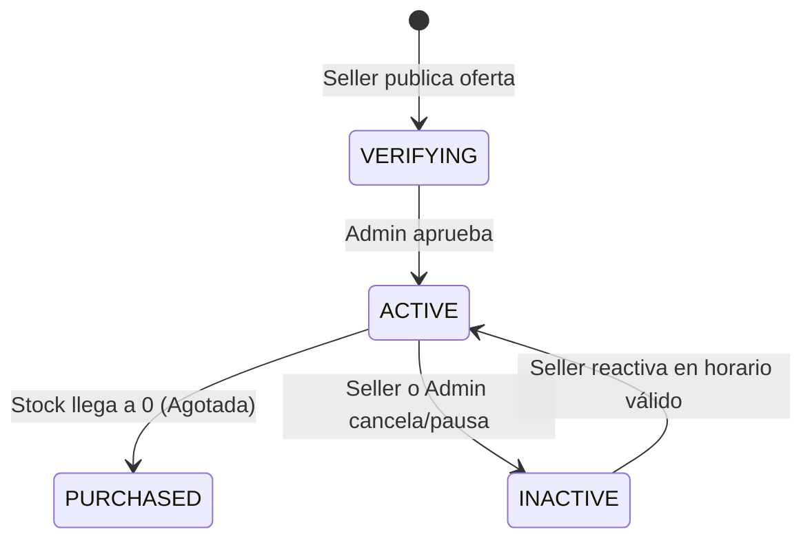
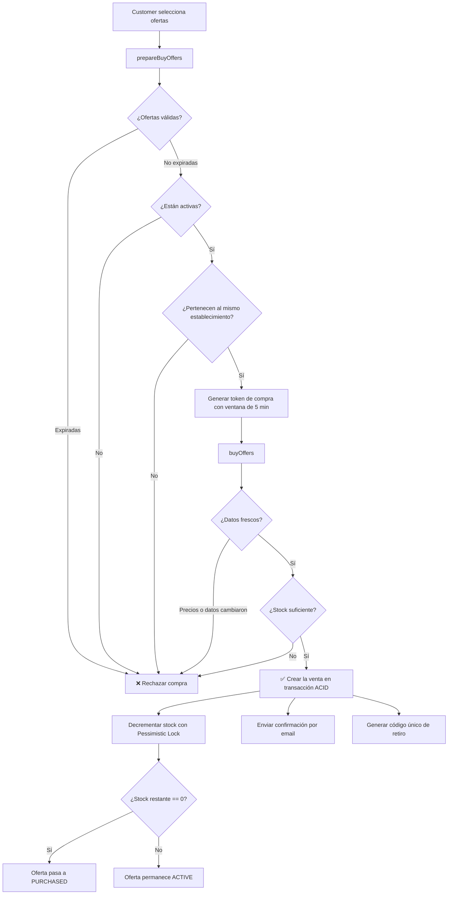

# Explicación: Lógica de Negocio y Reglas de Dominio

> **Tipo**: Explicación / Arquitectura (Diátaxis)  
> **Objetivo**: Delimitar formalmente qué constituye regla de negocio pura en Tatelestai frente a detalles de infraestructura técnica, analizando los tres actores del sistema, la distribución de responsabilidades y el flujo crítico de compra.

---

## 1. ¿Qué es Tatelestai y cuál es su Dominio?

**Tatelestai** es una plataforma web de economía circular que conecta **establecimientos gastronómicos** con **consumidores** para la venta de **excedentes de alimentos** a precios accesibles, combatiendo de forma directa el desperdicio alimentario.

El dominio se estructura en torno a **tres actores clave**:

1. **Administrador (Admin)**: Supervisa el ecosistema, valida la identidad de los comercios y audita publicaciones para garantizar la seguridad bromatológica y comercial.
2. **Vendedor (Seller)**: Comercio o restaurante que gestiona su inventario de excedentes del día y define franjas horarias estrictas de retiro.
3. **Comprador (Customer)**: Usuario final que localiza ofertas activas mediante proximidad geográfica, las reserva y las retira físicamente con código o QR.

---

## 2. El Principio: ¿Qué es (y qué no es) Lógica de Negocio?

Para mantener una arquitectura limpia y desacoplada, el proyecto adopta una distinción estricta:

> **Regla de Negocio Pura**: Es aquella política que existiría en el mundo real aunque no existieran computadoras ni software. Puede explicarse en lenguaje natural a un gerente o dueño de restaurante sin mencionar tecnologías.
>
> **Detalle de Infraestructura**: Es el mecanismo técnico utilizado para persistir, transportar, autenticar o mostrar la información. Si se cambia de base de datos o de framework web, el detalle cambia, pero la regla de negocio se mantiene inmutable.

---

## 3. Catálogo de Reglas de Negocio en Tatelestai

### 3.1. Máquina de Estados del Vendedor

Un comercio no puede publicar ofertas inmediatamente al registrarse; requiere una verificación administrativa.

| Archivo / Clase | Regla de Negocio Implementada |
|---|---|
| `app/Enums/UserState.php` | Define los estados válidos del vendedor (`selecting`, `registering`, `waiting_for_confirmation`, `active`, `denied_confirmation`, `inactive`). |
| `app/Actions/IsSellerActivableAction.php` | **Regla**: Un vendedor solo puede ser activado si se encuentra en estado `waiting_for_confirmation`, `inactive` o `denied_confirmation`. |
| `app/Actions/IsDeactivableSellerAction.php` | **Regla**: Un vendedor solo puede ser desactivado si está actualmente `active` o `denied_confirmation`. |
| `app/Actions/DeactivateSellerAndOffersAction.php` | **Regla**: Al desactivar un vendedor, **todas sus ofertas activas se desactivan automáticamente en cascada** para impedir compras en un comercio suspendido. |

---

### 3.2. Ciclo de Vida y Restricciones de Ofertas

| Archivo / Clase | Regla de Negocio Implementada |
|---|---|
| `app/Enums/OfferState.php` | Estados válidos: `verifying`, `active`, `purchased`, `inactive`. |
| `app/Actions/Offers/CreateOfferAction.php` | **Regla**: Toda oferta nueva inicia en estado `verifying`. **Regla**: Todos los productos del paquete deben pertenecer obligatoriamente al comercio del vendedor autenticado. |
| `app/Actions/Offers/ValidateOfferExpirationAction.php` | **Regla**: No se puede publicar, reservar ni vender una oferta cuya fecha y hora de expiración ya haya pasado. |
| `app/Actions/Offers/ValidateProductOwnershipAction.php` | **Regla**: Un vendedor solo puede armar ofertas utilizando sus propios productos registrados. |
| `app/Actions/DeactivateEstablishmentOffersAction.php` | **Regla**: Al suspenderse un local, se pausan automáticamente todas sus ofertas activas. |

---

### 3.3. Proceso Transaccional de Compra (El Núcleo del Sistema)

El flujo de compra requiere validar disponibilidad, coherencia de precios y consistencia de inventario en tiempo real:

| Archivo / Clase | Regla de Negocio Implementada |
|---|---|
| `app/Http/Controllers/CustomerSellController.php` | **Regla**: El comprador dispone de una ventana de **5 minutos** para confirmar la compra tras prepararla. |
| `app/Actions/Sell/VerifyPurchaseDataFreshnessAction.php` | **Regla**: Los datos que el comprador confirmó (precios unitarios, cantidades y productos) deben coincidir exactamente con los actuales. Si el vendedor alteró el precio durante el proceso, la compra se aborta por protección al consumidor. |
| `app/Actions/Sell/makeSellAction.php` | **Regla**: Si no hay stock suficiente para cubrir la cantidad solicitada, la orden se rechaza íntegramente. **Regla**: Si el stock llega a cero, el estado cambia atómicamente a `purchased`. |
| `app/Actions/Sell/CalculateMaxPickupDatetimeAction.php` | **Regla**: La fecha y hora límite de retiro del pedido completo se calcula como la fecha de expiración más próxima entre todas las ofertas incluidas en la compra. |
| `app/Actions/Sell/GeneratePickupCodeAction.php` | **Regla**: Cada venta genera un código alfanumérico único para retiro en mostrador. |

---

### 3.4. Carrito de Compras y Reportes

* **Carrito (`CartState`)**: Puede estar `active` o `purchased`.
  * `AddToCartAction`: Impide agregar mayor cantidad que el stock remanente; restringe la adición a ofertas activas y no vencidas; acumula cantidades si la oferta ya residía en el carrito.
* **Sistema de Reclamos (`ReportReason` y `ReportStatus`)**:
  * Motivos válidos de auditoría: fraude, información engañosa, spam, calidad deficiente, higiene, productos vencidos.
  * `CreateReportAction`: Impide que un usuario emita reportes duplicados contra la misma entidad mientras mantenga uno previo en estado `pending` o `reviewing`.

---

## 4. Mapa de Separación: Negocio vs. Infraestructura

| Componente | Rol en Tatelestai | Clasificación Arquitectónica |
|---|---|---|
| **Actions** (`app/Actions/**`) | Encapsulan una única decisión o mutación de negocio. | ✅ **Lógica de Negocio Pura** |
| **Enums** (`app/Enums/**`) | Definen estados, roles y categorías válidas del dominio. | ✅ **Lógica de Negocio Pura** |
| **DTOs** (`app/DTOs/**`) | Transportan datos tipados e inmutables entre capas. | 🔀 **Capa de Aplicación / Transporte** |
| **Form Requests** (`app/Http/Requests/**`) | Validaciones sintácticas de formato HTTP (tipos, required, email). | 🌐 **Capa de Presentación** |
| **Controllers** (`app/Http/Controllers/**`) | Reciben peticiones HTTP, delegan a Actions y retornan JSON. | 🌐 **Capa de Presentación** |
| **Repositories / Eloquent** (`app/Repositories/**`, `Models/**`) | Consultas SQL, joins, relaciones y persistencia relacional. | 💾 **Infraestructura (Datos)** |
| **Services Externos** (`GmailService`, `GooglePlacesService`) | Conexión HTTP a APIs de terceros y envío SMTP. | 🔌 **Infraestructura (Servicios)** |
| **Scout / Typesense Adapter** | Algoritmos de indexación y búsqueda por proximidad. | 🔍 **Infraestructura (Búsqueda)** |

---

## 5. Conclusión y Calidad del Diseño

El uso intensivo de **Actions de Dominio** de responsabilidad única (Single Responsibility Principle) en Tatelestai asegura que:
1. **La lógica de negocio se prueba de forma aislada** con pruebas unitarias rápidas sin depender de peticiones HTTP.
2. **Los controladores se mantienen livianos (*Thin Controllers*)**, limitándose a orquestar la entrada y salida HTTP.
3. **El sistema evoluciona de manera predecible**, permitiendo agregar nuevas políticas de negocio sin efectos secundarios en la capa de datos o presentación.
