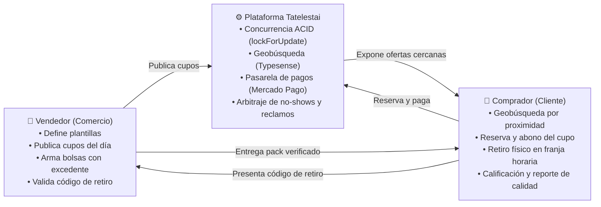
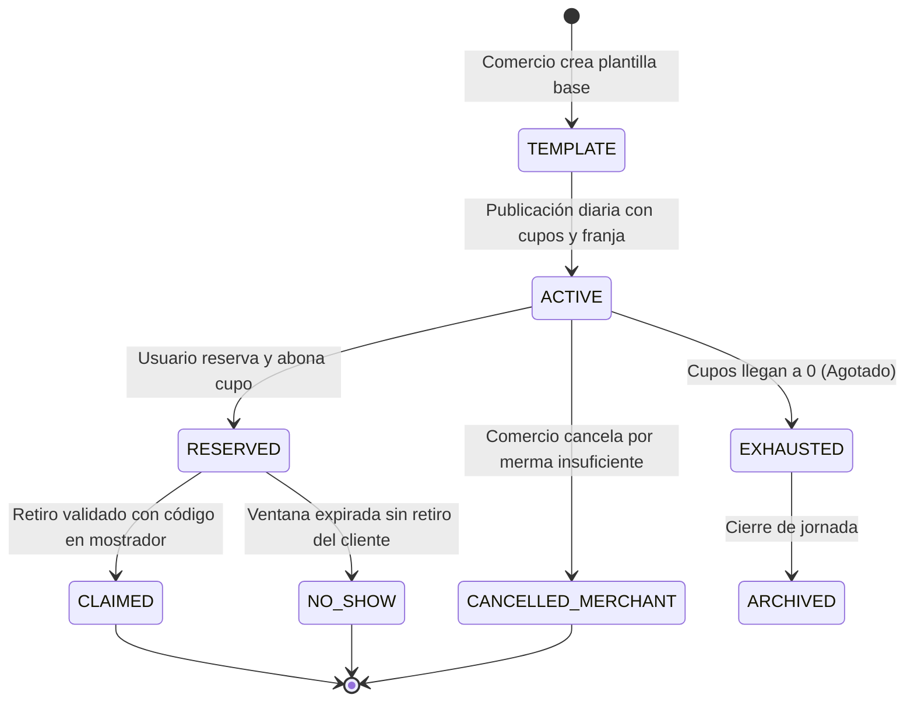
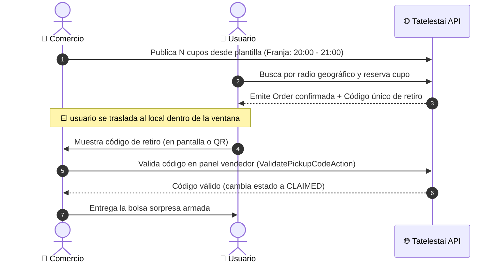
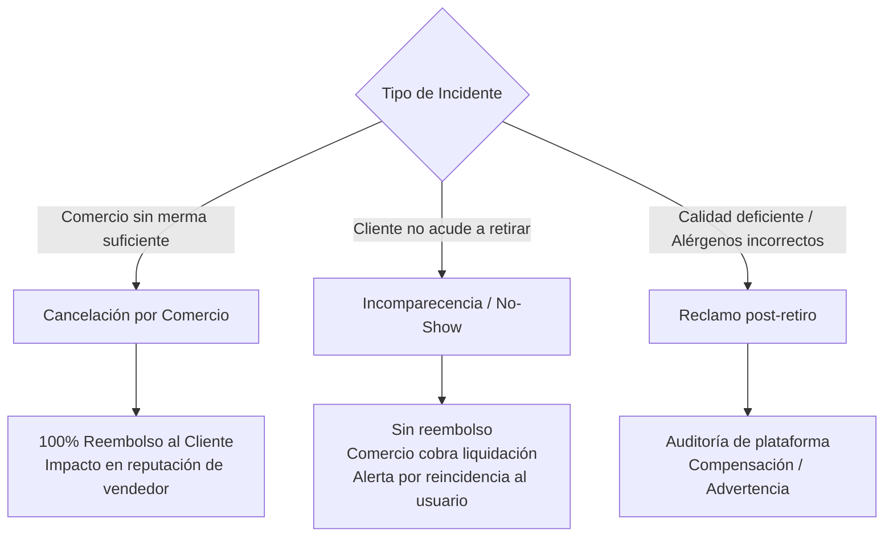

# Explicación: Lógica de Negocio de Packs Sorpresa

> **Tipo**: Explicación / Reglas de Dominio (Diátaxis)  
> **Objetivo**: Definir las reglas de negocio, ciclo de vida de ofertas, gestión de cupos vs. stock, políticas de armado, ventanas de retiro y penalizaciones para el modelo de bolsas sorpresa (*Surprise Bags*) en Tatelestai.  
> **Documentos Relacionados**: [Justificación del Cambio de Modelo](./justificacion-cambio-modelo-bolsas-sorpresa.md) · [ADR-0004: Transición al Modelo de Bolsas Sorpresa](./adrs/0004-transicion-a-modelo-bolsas-sorpresa.md) · [Lógica de Dominio y Reglas Generales](./logica-de-negocio-y-reglas.md)

---

## 1. Propósito del Documento

Definir formalmente cómo operan los **packs sorpresa** dentro de la plataforma Tatelestai (inspirados en el modelo de economía circular y rescate de comida de *Too Good To Go*). El propósito es alinear los modelos de dominio, las máquinas de estado, las reglas de concurrencia y las expectativas operativas de comercios y usuarios antes de consolidar el cambio en las capas de datos, lógica y presentación.

---

## 2. Concepto Central

Un **pack sorpresa** (o *bolsa sorpresa*) es un lote cerrado de productos excedentes aptos para consumo que un comercio gastronómico ofrece con un descuento significativo (habitualmente entre un 50% y 70% del valor de lista).

> [!IMPORTANT]
> **No se venden productos individuales:** Se comercializa una **experiencia de rescate**. El usuario compra un **cupo garantizado** para retirar un pack cuyo contenido específico no se desglosa previamente, pero cuyo valor acumulado original supera con creces el precio pagado.

---

## 3. Principios de Negocio

* **Simplicidad para el comercio**: Publicar y gestionar la oferta del día toma menos de 60 segundos (selección de plantilla preconfigurada y cantidad de cupos).
* **Confianza para el usuario**: El pack debe cumplir obligatoriamente un **valor mínimo garantizado** y respetar estrictamente las restricciones alimentarias y alérgenos declarados.
* **Flexibilidad operativa dinámica**: El comercio publica cupos según la merma real o estimada de su jornada.
* **Sin logística de entrega a domicilio**: Todo el modelo se basa en retiro físico (*pick-up*) en el local dentro de una franja horaria definida.
* **Métricas de impacto**: Cada transacción mide tanto el ahorro monetario como el peso estimado de alimentos rescatados y la mitigación de huella de carbono.

---

## 4. Actores y Roles en el Dominio

| Actor | Rol Principal | Responsabilidades Críticas |
|---|---|---|
| **Comercio (`Seller`)** | Generador de oferta | Crear plantillas base, publicar cupos diarios, armar los paquetes respetando alérgenos, verificar códigos al entregar y gestionar cancelaciones por falta de merma. |
| **Usuario (`Customer`)** | Rescatista de comida | Buscar comercios por radio de distancia, reservar/pagar en app, presentarse puntualmente en la ventana de retiro y validar la entrega. |
| **Plataforma (`Tatelestai`)** | Intermediario transaccional | Gestionar el control de concurrencia y stock (*pessimistic locking*), procesar pagos, calcular métricas de impacto ambiental y mediar ante reclamos o incomparecencias (*no-shows*). |

---

## 5. Ciclo de Vida de una Oferta de Pack Sorpresa

El ciclo de publicación y rescate se estructura en 5 fases estandarizadas:

1. **Plantilla del pack (`PackTemplate`)**: El comercio define una configuración estándar reutilizable (ej. *"Bolsa Sorpresa Mediodía"*, *"Pack Panadería Artesanal"*). Incluye descripción genérica, precio de venta, valor mínimo garantizado, categoría gastronómica, alérgenos potenciales y franja horaria habitual.
2. **Publicación diaria (`DailyOffer`)**: El comercio activa una oferta a partir de su plantilla indicando los cupos disponibles para la fecha y ajustando, si fuera necesario, la ventana de retiro.
3. **Reserva y pago (`OrderReserved`)**: El usuario abona el cupo mediante la plataforma. Se descuenta el stock atómicamente (`lockForUpdate`) y se emite un **código alfanumérico único** (o QR de retiro).
4. **Retiro físico (`Claim`)**: El usuario asiste al establecimiento dentro de la franja horaria y exhibe su código. El personal del local valida el código en su panel y entrega la bolsa.
5. **Cierre transaccional (`Completed` / `No-Show`)**: Se registra el retiro como completado. Si el usuario no asiste antes del vencimiento de la franja, la orden se liquida como *no-show*.

### Máquina de Estados del Pack Sorpresa

### Flujo Secuencial de Retiro

---

## 6. Gestión de Cupos vs. Stock de Ítems

A diferencia de un e-commerce tradicional, este modelo **no gestiona inventario de productos individuales**. El inventario es un contador entero de **cupos disponibles del día**:

* El comercio incrementa o reduce cupos en tiempo real según la evolución de sus ventas regulares.
* Al alcanzar `stock = 0`, la oferta pasa a estado `exhausted` en el motor de búsqueda Typesense.
* Si el local registra una venta inesperada de su carta regular y no cuenta con excedente suficiente, puede cancelar cupos no reservados o anular reservas activas emitiendo reembolso íntegro inmediato.
* La plataforma registra la tasa de cancelación del vendedor para evitar prácticas desleales.

> [!NOTE]
> La infraestructura de concurrencia existente (`lockForUpdate` documentada en [ADR-0001](./adrs/0001-bloqueo-pesimista-para-control-de-stock.md)) se reutiliza al 100%, operando sobre el cupo disponible de la oferta.

---

## 7. Precio y Valor Garantizado

* **Precio del pack**: Definido por el comercio, manteniendo una relación de descuento típicamente de 1/3 (33%) respecto al valor real de mercado.
* **Valor mínimo garantizado**: La suma del precio minorista habitual de los ítems introducidos en la bolsa debe igualar o superar este umbral (ej. Si el usuario paga $3.000, el pack debe contener alimentos valorados en $9.000 o más).
* **Comisión de la plataforma**: Cobro porcentual o canon fijo por transacción procesada y liquidada.

---

## 8. Reglas de Armado del Pack

El armado es manual y discrecional del comerciante al cierre de la jornada, pero debe cumplir reglas estrictas:

1. **Cumplimiento del valor mínimo**: La suma de los precios de venta al público de los productos incluidos debe ser igual o superior al valor comprometido en la plantilla.
2. **Aptitud bromatológica**: Alimentos frescos, elaborados en el día o remanentes de producción en perfecto estado organoléptico e higiénico.
3. **Respeto a restricciones y alérgenos**: Si la plantilla indica "Apto Celíacos (Sin TACC)" o "Vegetariano", bajo ninguna circunstancia pueden incorporarse alimentos que violen dicha declaración.
4. **Variedad razonable**: Se incentiva la inclusión de 2 o más variedades para asegurar una percepción positiva del rescate.

---

## 9. Ventanas de Retiro y Validación de Códigos

* Cada oferta diaria posee una **franja horaria con inicio y fin estrictos** (ej. 19:30 a 20:30 hs).
* La app envía notificaciones *push* y recordatorios al usuario antes del cierre de la franja.
* Si el cliente acude fuera de la ventana estipulada, el establecimiento se encuentra facultado para rechazar la entrega si el local ya concluyó su horario de atención.

---

## 10. Políticas de Cancelación, No-Shows y Reembolsos

* **Cancelación por el Comercio**: Reembolso automático total (100%) al comprador. Las cancelaciones reiteradas activan revisiones de moderación en el módulo de administración.
* **No-Show (Incomparecencia del Comprador)**: El comprador no se presenta dentro de la franja horaria. **No hay reembolso**, dado que el comercio reservó y armó el producto impidiendo su venta a terceros. El comercio percibe su liquidación correspondiente.
* **Cancelación voluntaria del Comprador**: Permitida únicamente hasta una ventana de corte previa (ej. hasta 2 horas antes del inicio del retiro).
* **Reclamos bromatológicos o discrepancia de valor**: El cliente puede adjuntar fotografías del pack recibido. Si no se cumplió el valor mínimo o se omitieron alérgenos declarados, la plataforma interviene aplicando sanciones y devoluciones.

---

## 11. Requisitos para el Panel del Comercio (`Seller`)

La interfaz del comerciante se simplifica radicalmente:

* **Gestor de plantillas**: Configuración de tipos de bolsa estándar (nombre, alérgenos, precio, franja habitual).
* **Publicador express del día**: Selección de plantilla + *stepper* de cantidad de cupos (1 clic para publicar).
* **Monitor de retiros en vivo**: Lista en tiempo real de compradores del día con campo de búsqueda rápida para validar el código de retiro al llegar el cliente.
* **Métricas de rescate**: Total de kilogramos de comida rescatada, ingresos netos generados y tasa de cumplimiento.

---

## 12. Experiencia del Usuario Comprador (`Customer`)

* **Geobúsqueda inmediata**: Vista de mapa interactivo y lista priorizada por proximidad (Typesense `_geoloc`).
* **Filtros funcionales**: Por franja horaria (mediodía/noche), categoría gastronómica (panadería, sushi, platos preparados, cafetería) y restricciones dietarias.
* **Tarjeta de oferta transparente**: Indica precio de compra, valor mínimo estimado, ventana horaria de retiro y distancia en km.
* **Billetera de retiros**: Vista clara del código alfanumérico y código QR dinámico listo para exhibir en el mostrador.

---

## 13. Métricas Clave de Negocio (KPIs)

| Métrica | Definición | Impacto |
|---|---|---|
| **Packs rescatados / día** | Volumen total de bolsas retiradas exitosamente | Adopción y liquidez de mercado |
| **Alimentos rescatados (kg)** | Estimación volumétrica de comida salvada | Impacto ecológico y RSE |
| **Emisiones de CO2 evitadas** | Coeficiente ambiental derivado del peso rescatado | Métrica de sostenibilidad |
| **Tasa de No-Show (%)** | Órdenes reservadas pero no retiradas | Eficiencia operativa y fricción |
| **Tasa de Cancelación de Comercio (%)** | Cupos cancelados por falta de excedente | Confiabilidad de la plataforma |
| **Calificación media de pack** | Puntuación de 1 a 5 asignada por el usuario | Calidad percibida de los comercios |

---

## 14. Marco Legal y Confianza Bromatológica

* **Declaración obligatoria de alérgenos**: Rotulado claro en la ficha de la plantilla (Gluten, Lácteos, Frutos secos, etc.).
* **Contrato de adhesión**: Aceptación explícita por parte del usuario de que el contenido exacto del lote es sorpresa y sujeto al excedente disponible del día.
* **Seguridad alimentaria**: Los alimentos entregados deben cumplir rigurosamente las ordenanzas bromatológicas vigentes; el descuento responde a la proximidad del cierre de turno, no a la pérdida de aptitud para consumo.

---

## 15. Decisiones de Implementación en Tatelestai

Para la integración en el stack actual de Laravel + Vue 3:

1. **Discriminador de oferta**: La tabla `offers` incorpora `offer_type` con valores `standard` y `pack`.
2. **Desacoplamiento de `product_offers`**: Las ofertas de tipo `pack` no requieren asociar productos individuales de catálogo; su descripción y alérgenos residen en la propia oferta o en la plantilla.
3. **Persistencia de cupos**: El campo `stock` de la tabla `offers` representa los cupos remanentes del día, protegido bajo la misma estrategia de `lockForUpdate`.
4. **Validación de entrega**: `ClaimCode` generado al emitir la orden (`Sell`), validado mediante un endpoint dedicado en el panel del comerciante.

---

**Nota:** Este documento describe formalmente la lógica de negocio y las reglas de dominio. Complementa a [justificacion-cambio-modelo-bolsas-sorpresa.md](./justificacion-cambio-modelo-bolsas-sorpresa.md) y al registro de decisión arquitectónica [ADR-0004: Transición al Modelo de Bolsas Sorpresa](./adrs/0004-transicion-a-modelo-bolsas-sorpresa.md).
