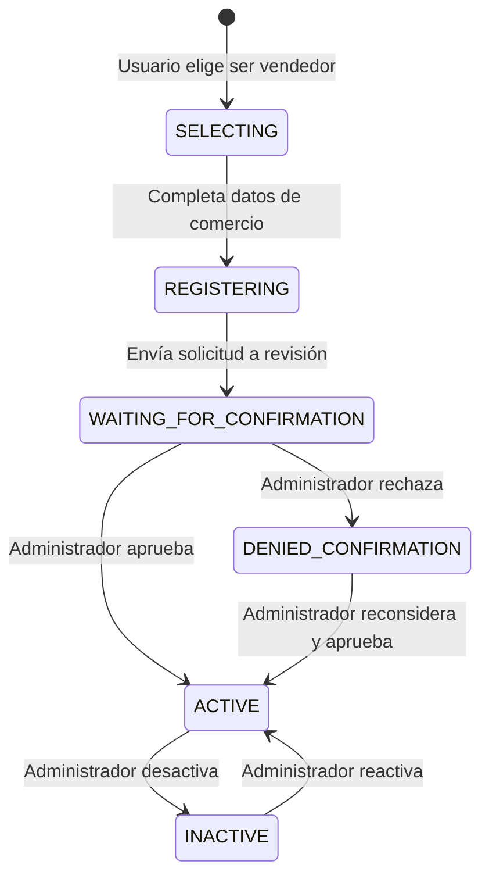
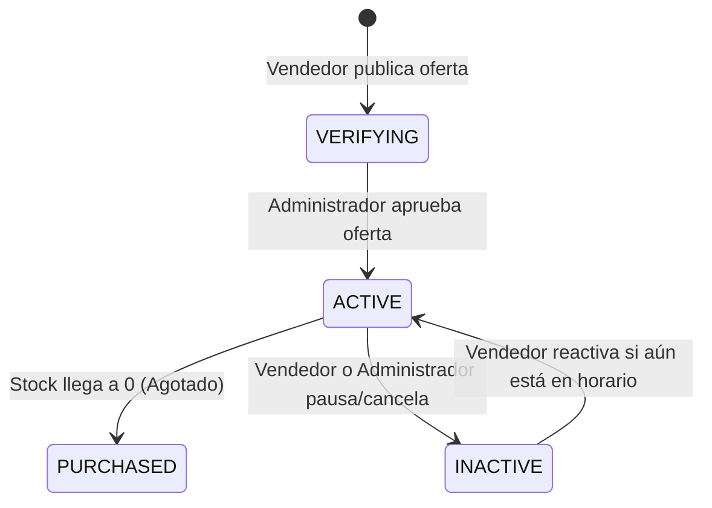
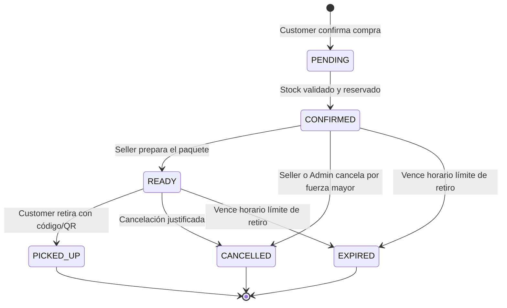
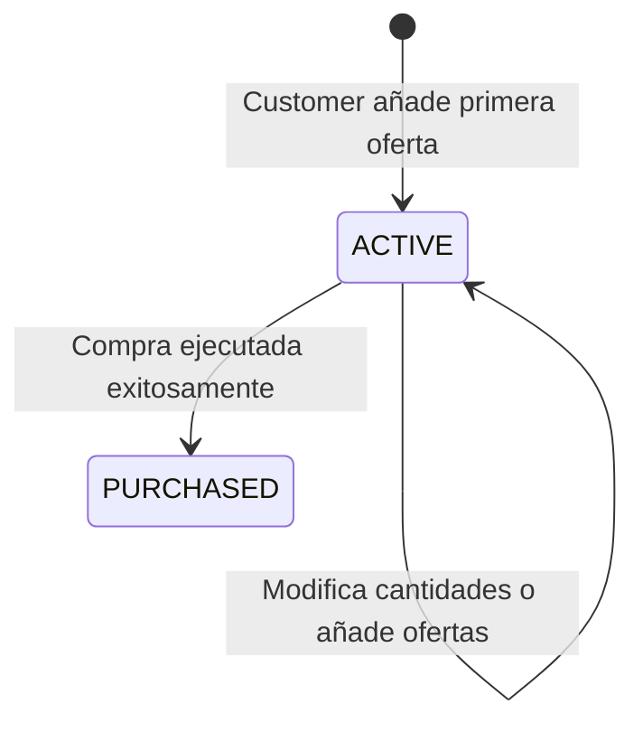

# Explicación: Máquinas de Estado del Dominio

> **Tipo**: Explicación / Arquitectura (Diátaxis)  
> **Objetivo**: Documentar los modelos conceptuales y ciclos de vida de las entidades principales (Vendedores y Ofertas), diferenciando la regla de negocio pura de la infraestructura.

---

## 1. Ciclo de Vida del Vendedor (Seller)

Un establecimiento gastronómico no puede publicar ofertas inmediatamente al registrarse; debe atravesar un proceso de verificación que garantice la legitimidad del comercio.

### Diagrama de Estados

### Reglas de Negocio Asociadas

1. **Activación Restringida**: Un vendedor solo puede pasar a estado `ACTIVE` si actualmente se encuentra en `WAITING_FOR_CONFIRMATION`, `INACTIVE` o `DENIED_CONFIRMATION`.
2. **Desactivación en Cascada**: Cuando un vendedor es marcado como `INACTIVE`, **todas sus ofertas activas se desactivan automáticamente** para impedir que los compradores adquieran productos de un comercio suspendido (`DeactivateSellerAndOffersAction`).

---

## 2. Ciclo de Vida de la Oferta (Offer)

Las ofertas representan los paquetes de comida excedente disponibles para retiro en una franja horaria determinada.

### Diagrama de Estados

### Reglas de Negocio Asociadas

1. **Pertenencia de Productos**: Todos los productos incluidos en un paquete de oferta deben pertenecer al establecimiento del vendedor autenticado (`CreateOfferAction`).
2. **Transición Atómica a Agotado**: Cuando una compra reduce el stock a cero dentro de una transacción con bloqueo pesimista, la oferta transiciona inmediatamente a `PURCHASED`.
3. **Restricción de Compra**: Un comprador solo puede adquirir ofertas cuyo estado sea estrictamente `ACTIVE`.

---

## 3. Ciclo de Vida de la Venta (Sell / Order)

La venta representa el compromiso de compra y el contrato de retiro físico en el local gastronómico.

### Diagrama de Estados

### Reglas de Negocio Asociadas

1. **Ventana de Retiro**: Cada venta calcula su fecha y hora máxima de retiro (`max_pickup_datetime`) basada en la fecha de vencimiento más temprana de los productos contenidos.
2. **Retiro Verificado**: Para pasar a `PICKED_UP`, el comprador debe presentar el código alfanumérico generado por `GeneratePickupCodeAction`, validado por el vendedor en el sistema.
3. **Expiración de Paquetes no Retirados**: Si la hora actual supera la ventana de retiro sin que el pedido haya sido retirado, la venta transiciona a `EXPIRED`.

---

## 4. Ciclo de Vida del Carrito de Compras (Cart)

### Reglas de Negocio Asociadas

1. **Unicidad de Establecimiento**: Un carrito solo puede procesar compras si todas las ofertas añadidas pertenecen al **mismo establecimiento gastronómico** (para garantizar un único punto de retiro por pedido).
2. **Validación Dinámica de Stock**: Al momento de proceder al checkout, se vuelve a verificar que el stock solicitado siga disponible (`VerifyPurchaseDataFreshnessAction`).
3. **Transición a Comprado**: Cuando la venta se confirma, el carrito pasa a `PURCHASED` y se desvincula para permitir la apertura de un nuevo carrito activo.

---

## 5. Implementación en Código

Para garantizar consistencia y evitar cadenas mágicas (*string literals*), todos los estados se modelan mediante **PHP 8 Backed Enums**:

* `App\Enums\UserState`: Estados del vendedor (`selecting`, `registering`, `waiting_for_confirmation`, `active`, `denied_confirmation`, `inactive`).
* `App\Enums\OfferState`: Estados de la oferta (`verifying`, `active`, `purchased`, `inactive`).
* `App\Enums\SellState`: Estados de la venta (`pending`, `confirmed`, `ready`, `picked_up`, `cancelled`, `expired`).
* `App\Enums\CartState`: Estados del carrito (`active`, `purchased`).
* `App\Enums\ReportStatus`: Estados de reclamos (`pending`, `reviewing`, `resolved`, `dismissed`).

Las transiciones válidas y verificaciones están encapsuladas en **Actions de Dominio** de responsabilidad única (ej. `IsSellerActivableAction`, `makeSellAction`, `AddToCartAction`).
