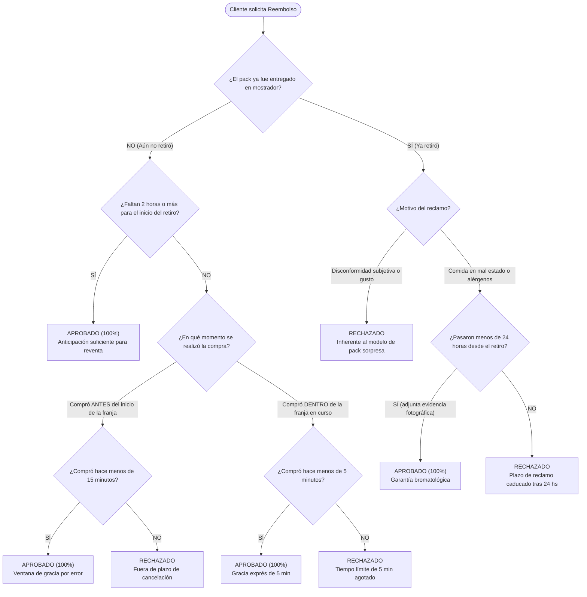

# Explicación: Políticas de Cancelación y Reembolsos

> **Tipo**: Explicación / Reglas de Dominio (Diátaxis)  
> **Objetivo**: Especificar de forma aislada y rigurosa las políticas, ventanas de corte y árbol de decisión para cancelaciones voluntarias, incomparecencias y reembolsos en Tatelestai.  
> **Documentos Relacionados**: [Lógica de Negocio de Packs Sorpresa](./logica-negocio-packs-sorpresa.md) · [Lógica de Dominio y Reglas Generales](./logica-de-negocio-y-reglas.md) · [ADR-0001: Bloqueo Pesimista](./adrs/0001-bloqueo-pesimista-para-control-de-stock.md)

---

## 1. Propósito

Este documento delimita formalmente **cuándo, por qué y cómo** se aprueba o rechaza una solicitud de reembolso monetario en Tatelestai, protegiendo tanto la experiencia del consumidor como la viabilidad económica de los establecimientos gastronómicos adheridos.

---

## 2. Árbol de Decisión: Solicitud de Reembolso

El siguiente diagrama modela de forma pura el proceso de evaluación que se ejecuta ante cualquier solicitud de cancelación o reclamo de reembolso:



---

## 3. Matriz Normativa de Reembolsos

| Escenario | Momento del Evento | Condición de Aprobación | ¿Reembolso? | Destino del Stock |
|---|---|---|:---:|---|
| **Cancelación con anticipación** | Pre-retiro | Solicitada con **>= 2 horas** de anticipación al inicio de la franja. | **100%** | Se reintegra al inventario (`Offer.quantity + 1`) y se reindexa en Typesense. |
| **Gracia por compra reciente (Pre-franja)** | Pre-retiro | Compra realizada antes de la franja; cancelación dentro de los primeros **15 minutos**. | **100%** | Se reintegra al inventario para venta inmediata. |
| **Gracia exprés (Intra-franja)** | Pre-retiro | Compra realizada durante el horario en curso; cancelación dentro de los primeros **5 minutos**. | **100%** | Se libera el cupo para compra presencial o en app. |
| **Incomparecencia (*No-Show*)** | Durante / Post-franja | El comprador no asiste dentro de la franja horaria. | **0%** | El comercio cobra su liquidación íntegra; la bolsa no se reembolsa. |
| **Cancelación por el Comercio** | Pre-retiro | Comercio sin merma suficiente o fuerza mayor (cierre imprevisto). | **100%** | N/A (Oferta pausada). Notificación automática inmediata al cliente. |
| **Garantía Bromatológica / Alérgenos** | Post-retiro | Alimentos en mal estado o violación de alérgenos reportados en **< 24 horas** con fotos. | **100%** | Arbitrado por moderación; impacto en liquidación del vendedor. |
| **Reclamo Extemporáneo** | Post-retiro | Reporte iniciado después de las 24 horas del retiro. | **0%** | Caducado (imposibilidad de auditar conservación doméstica). |

---

## 4. Detalle de Reglas de Negocio

### 4.1. Cancelación Pre-Retiro
1. **Regla de las 2 Horas**: Permite al marketplace disponer de una ventana operativa mínima para alertar a otros comensales cercanos e incentivar el rescate del alimento antes de que el local concluya su turno.
2. **Ventana de Gracia Diferenciada**:
   * **15 minutos (Compras antes de la franja)**: Protege ante clics accidentales, selección errónea de sucursal o equivocación en el método de pago con tiempo suficiente previo al retiro.
   * **5 minutos (Compras dentro de la franja en curso)**: Si el usuario compra de último momento (ej. caminando frente al local a horario de retiro iniciado), el tiempo es crítico. Se reduce a 5 minutos el margen para corregir errores, impidiendo que una orden quede bloqueada durante el cierre del local.

### 4.2. Incomparecencia (*No-Show*)
* Los alimentos perecederos preparados para un pack sorpresa no pueden reingresarse al circuito comercial regular al finalizar el turno.
* Por ello, el *No-Show* **no da derecho a reembolso**. La plataforma liquida los fondos al comerciante y registra la falta en el historial del comprador.

### 4.3. Reclamos Bromatológicos Post-Retiro
* **Límite improrrogable de 24 horas**: Trascurrido un día, factores ajenos al comercio (ruptura de cadena de frío en el hogar, contaminación cruzada doméstica) invalidan cualquier dictamen pericial o auditoría de moderación.
* **Carga de la prueba**: El usuario debe adjuntar fotografía legible del producto objetado y el ticket/código de la compra.

---

## 5. Implementación en Backend (Laravel)

### 5.1. Transición de Estados en `Sell`
Al aprobarse una cancelación o reembolso pre-retiro:
1. `Sell.state` muta a `SellState::CANCELLED`.
2. El `pickup_code` queda inmediatamente revocado (la validación en mostrador retornará error `HTTP 422 - Código inválido o cancelado`).
3. El stock de la oferta se restituye atómicamente:
   ```php
   Offer::query()->where('id', $offerId)->increment('quantity', $quantity);
   // Si la oferta figuraba como 'purchased' (agotada), vuelve a 'active'
   $offer->update(['state' => 'active']);
   ```

### 5.2. Liquidación y Pasarela de Pagos
* Se invoca el endpoint de reembolso de la pasarela (ej. Mercado Pago Refunds API: `POST /v1/payments/{payment_id}/refunds`).
* El monto se acredita de vuelta en el medio de pago original del comprador sin costo de penalización.
