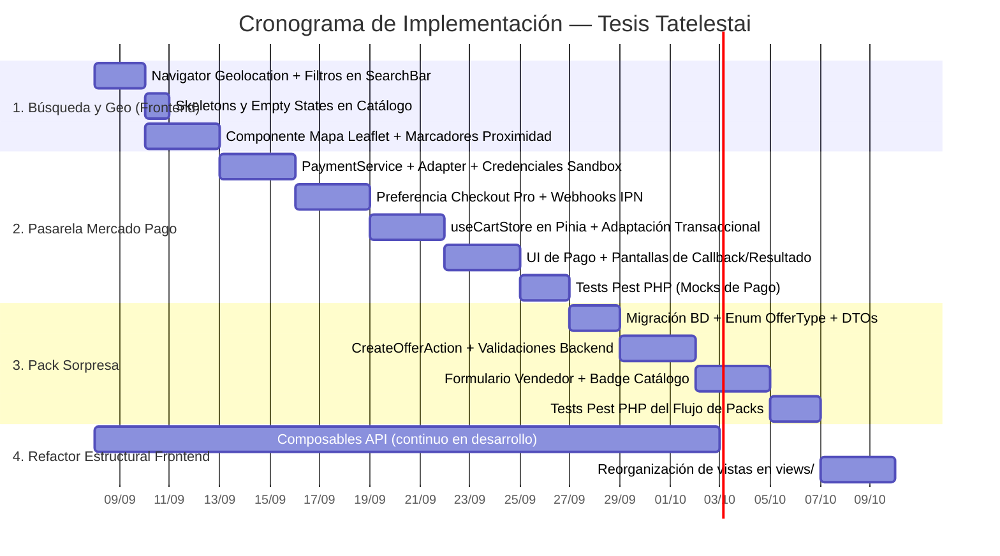

# Análisis de Priorización de Tareas — Tatelestai (Tesis)

> **Contexto**: Proyecto de tesis. No hay usuarios reales por el momento. Las tareas se evalúan por **valor académico/demostrativo** y **complejidad técnica**.  
> **Método**: Valor / Complejidad (escala 1-10). Se descarta RICE porque sin usuarios reales el "Reach" no aplica.  
> **Guía base**: [Guía de Cálculo de Puntajes](./guia-calculo-puntajes-tareas.md)  
> **Documentos de referencia**: [Roadmap de Desarrollo](./roadmap-de-desarrollo.md) · [Alcance y Requisitos MoSCoW](./alcance-y-requerimientos-moscow.md)

---

## Resumen Ejecutivo

| # | Tarea | Valor (1-10) | Complejidad (1-10) | Ratio | Veredicto | Orden Recomendado |
|---|---|---|---|---|---|---|
| 🗺️ | **Búsquedas Geolocalizadas (Frontend)** | 9 | 3 | **3.00** | 🟢 Quick Win | **1º** |
| 💳 | **Mercado Pago** | 9 | 7 | **1.29** | 🟡 Sprint actual | **2º** |
| 📦 | **Pack Sorpresa** | 7 | 5 | **1.40** | 🟡 Sprint actual | **3º** |
| 🎨 | **Refactor UI/UX** | 8 | 7 | **1.14** | 🟡 Sprint actual (incremental) | **4º** |

---

## 1. 🗺️ Búsquedas Geolocalizadas en el Frontend

**Valor: 9 / 10** · **Complejidad: 3 / 10** · **Ratio: 3.00**

### Justificación de Valor (9/10)
- Demuestra la **integración full-stack completa**: Typesense geo-indexing → API REST con filtros espaciales → frontend con `navigator.geolocation`.
- Es el **diferenciador central** de Tatelestai: rescate de alimentos por proximidad inmediata. Sin geolocalización, la plataforma actúa como un catálogo estático.
- Para la defensa de tesis, mostrar búsqueda interactiva por radio y visualización en mapa tiene un impacto visual y técnico decisivo.

### Justificación de Complejidad (3/10)
El backend ya está **100% implementado**:
- `TypesenseSearchAdapter` ya filtra por coordenadas `_geoloc:(lat, lng, radius km)` y ordena por distancia ascendente.
- El endpoint `OfferCustomerController::index` ya recibe parámetros opcionales `lat`, `lng` y `radius`.
- En el frontend solo se requiere capturar la ubicación en el navegador, pasar los query params y renderizar el mapa interactivo.

### Desglose de Subtareas

| Subtarea | Capa | Esfuerzo Estimado |
|---|---|---|
| Obtener coordenadas con `navigator.geolocation.getCurrentPosition()` en la vista del cliente | Frontend | ~2h |
| Enviar `lat`, `lng`, `radius` al endpoint desde `SearchBar.vue` | Frontend | ~2h |
| Selector de radio dinámico (ej. 1 km, 3 km, 5 km, 10 km) | Frontend | ~3h |
| Componente de mapa interactivo con Leaflet/MapLibre con marcadores y popups de ofertas | Frontend | ~8h |
| Manejo amigable de permisos denegados (fallback a búsqueda global sin geolocalización) | Frontend | ~1h |

> [!TIP]
> **Recomendación**: Implementar el mapa interactivo con Leaflet/OpenStreetMap. Al ser una tesis, la demostración visual en vivo aporta un salto de calidad indiscutible.

---

## 2. 💳 Integración de Pasarela de Pagos (Mercado Pago)

**Valor: 9 / 10** · **Complejidad: 7 / 10** · **Ratio: 1.29**

### Justificación de Valor (9/10)
- **Requisito obligatorio para el alcance de tesis**.
- Acredita la integración con APIs externas de terceros bajo estándares de la industria (OAuth, webhooks, idempotencia y pagos asíncronos).
- Demuestra dominio avanzado de transacciones ACID, control de concurrencia y manejo de estados distribuidos.

### Justificación de Complejidad (7/10)
- Requiere integrar el SDK oficial `mercadopago/dx-php` y gestionar credenciales en modo Sandbox.
- Implementación de Webhooks IPN públicos y seguros para procesar notificaciones asincrónicas de cambio de estado de pago.
- Acoplamiento con el flujo transaccional actual: conciliar la reserva temporal (`purchase_token` de 5 minutos y `lockForUpdate`) con los tiempos de respuesta de la pasarela.
- Manejo de estados: `pending`, `approved`, `rejected`, `refunded`.

### Desglose de Subtareas

| Subtarea | Capa | Esfuerzo Estimado |
|---|---|---|
| Instalar SDK `mercadopago/dx-php` y parametrizar credenciales sandbox en `.env` | Backend | ~2h |
| Crear `PaymentService` y contrato `PaymentServiceInterface` (Patrón Adapter) | Backend | ~4h |
| Endpoint para generar preferencia de pago (Checkout Pro) | Backend | ~3h |
| Endpoint público para Webhooks IPN + Listener/Action de actualización de estado | Backend | ~4h |
| Migración: agregar `payment_id`, `payment_status`, `payment_method` a la tabla `sells` | Backend / BD | ~2h |
| Adaptar `makeSellAction` para reservar stock → esperar confirmación de pago → finalizar o liberar stock | Backend | ~6h |
| Botón "Pagar con Mercado Pago" en la vista de confirmación del cliente | Frontend | ~4h |
| Pantallas de feedback post-pago (aprobado, pendiente, rechazado) | Frontend | ~3h |
| Tests automatizados con Pest PHP (mockeando las respuestas del servicio de pago) | Backend | ~4h |

> [!IMPORTANT]
> **Decisión Técnica Recomendada**: Utilizar **Mercado Pago Checkout Pro** (modal/redirección administrada por Mercado Pago). Reduce enormemente la superficie de error, simplifica el cumplimiento de seguridad y es el estándar idóneo para demostraciones académicas.

---

## 3. 📦 Ofertas Compuestas tipo "Pack Sorpresa"

**Valor: 7 / 10** · **Complejidad: 5 / 10** · **Ratio: 1.40**

### Justificación de Valor (7/10)
- Permite modelar el caso de uso insignia de plataformas como *Too Good To Go*: bolsas sorpresa de panadería, verdulería o rotisería sin desglose unitario previo.
- Demuestra aplicación práctica de Domain-Driven Design (DDD) táctico y extensibilidad del modelo relacional sin romper compatibilidad retrospectiva (principio Open/Closed).
- Reduce sustancialmente la fricción de carga de datos para los comercios.

### Justificación de Complejidad (5/10)
- El diseño conceptual y relacional ya está contemplado en la **Fase 3 del Roadmap** del proyecto.
- Requiere migración para introducir discriminador de tipo (`offer_type`: `standard`, `pack`) y flexibilizar la obligatoriedad de la tabla pivote `product_offers`.
- Requiere adaptar validaciones en FormRequests y DTOs (`CreateNewOfferDTO`), además de ajustar la interfaz del comerciante.

> [!NOTE]
> **Especificación Formal y Justificación**:
> * Reglas de negocio y flujo de retiro: [Lógica de Negocio: Packs Sorpresa](../explanation/logica-negocio-packs-sorpresa.md).
> * Fundamentos técnicos y mitigación de fricción: [Justificación del Cambio de Modelo](../explanation/justificacion-cambio-modelo-bolsas-sorpresa.md).
> * Registro de decisión: [ADR-0004: Transición al Modelo de Bolsas Sorpresa](../explanation/adrs/0004-transicion-a-modelo-bolsas-sorpresa.md).

### Desglose de Subtareas

| Subtarea | Capa | Esfuerzo Estimado |
|---|---|---|
| Migración: agregar columna `offer_type` (`standard` / `pack`) a tabla `offers` | Backend / BD | ~2h |
| Migración: permitir que ofertas tipo pack no requieran registros en `product_offers` | Backend / BD | ~2h |
| Enum `OfferType` y adaptación de DTOs (`CreateNewOfferDTO`, `OfferDTO`) | Backend | ~2h |
| Refactorizar `CreateOfferAction` para bifurcar la persistencia según el tipo de oferta | Backend | ~4h |
| FormRequest con validación condicional de campos según `offer_type` | Backend | ~2h |
| Formulario de creación de Pack Sorpresa en el panel del vendedor | Frontend | ~5h |
| Badge y estilo distintivo "Pack Sorpresa 🎁" en catálogo y modales | Frontend | ~1h |
| Adaptar vista de confirmación de compra y código de retiro para packs | Full-stack | ~3h |
| Tests de integración con Pest PHP para el ciclo de vida del pack | Backend | ~3h |

---

## 4. 🎨 Refactor UI/UX y Arquitectura Frontend

**Valor: 8 / 10** · **Complejidad: 7 / 10** · **Ratio: 1.14**

### Justificación de Valor (8/10)
- Para la evaluación de tesis, la legibilidad, mantenibilidad y modularidad del código frontend es un criterio calificador.
- Eliminar el acoplamiento directo de llamadas HTTP (`axiosInstance.get/post`) dentro de los componentes demuestra dominio de patrones modernos en Vue 3 (Composables, Services, Separation of Concerns).
- La experiencia visual (loading states, skeletons, transiciones, empty states) transmite solidez en la presentación.

### Justificación de Complejidad (7/10)
- Existen más de 45 componentes distribuidos en carpetas de layouts por rol.
- Mover archivos y renombrar rutas sin tests de frontend puede introducir errores de navegación.
- Intentar un rediseño completo de una sola vez ("Big Bang") compromete los plazos de entrega.

### Estrategia de Ejecución: Refactorización Incremental por Fases

| Fase | Subtarea | Valor | Complejidad | Ratio | Momento Óptimo |
|---|---|---|---|---|---|
| **A** | Composables reutilizables de API (`useOffers()`, `useCart()`, `useSells()`) | 8 | 4 | **2.00** ✅ | Acompañando cada feature |
| **B** | Store dedicado `useCartStore` en Pinia | 7 | 3 | **2.33** ✅ | Junto con Mercado Pago |
| **C** | Skeletons de carga y Empty States | 7 | 3 | **2.33** ✅ | Junto con la geolocalización |
| **D** | Reorganizar vistas desde `components/layouts/` hacia `views/` | 6 | 5 | **1.20** | Post implementación de features |
| **E** | Migración a biblioteca de UI (ej. Shadcn-vue / Radix) | 5 | 7 | **0.71** ⚠️ | Opcional / Fuera de alcance |

> [!TIP]
> **Regla de oro**: Las fases **A**, **B** y **C** deben ejecutarse *en paralelo* mientras se construyen las features funcionales. Por ejemplo: al implementar Mercado Pago, se extrae la lógica del carrito a `useCartStore` y se usa un composable `usePayment()`.

---

## Plan de Ejecución Integrado (Cronograma Recomendado)

---

## Preguntas Abiertas para Definición Técnica

1. **Mapa de Geolocalización**: ¿Avanzamos con **Leaflet + OpenStreetMap** (100% gratuito, sin límites de cuota de API, ideal para tesis) o prefieres Google Maps JS API?
2. **Modelo del Pack Sorpresa (✅ Resuelta)**: Formalizada a favor de **Bolsas Sorpresa con cupos diarios** (sin catálogo individual, con valor mínimo garantizado y precio bonificado fijado por el comercio). Ver [Lógica de Negocio: Packs Sorpresa](../explanation/logica-negocio-packs-sorpresa.md) y [ADR-0004](../explanation/adrs/0004-transicion-a-modelo-bolsas-sorpresa.md).
3. **Librería de Componentes**: ¿Mantenemos Tailwind CSS v4 puro estandarizando componentes propios, o evaluamos incorporar Shadcn-Vue / PrimeVue?
