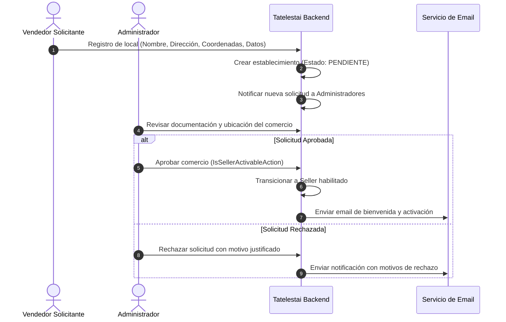

# Especificación Funcional: Módulo de Administración

> **Tipo**: Gestión de Proyecto / Especificación Funcional  
> **Objetivo**: Documentar en detalle los casos de uso, flujos y reglas de negocio del panel administrativo de Tatelestai para la moderación de ofertas, gestión del ciclo de vida de usuarios y comercios, y auditoría transaccional.

---

## 1. Visión General del Módulo

El rol **Administrador (`admin`)** posee el nivel máximo de privilegios en el sistema. Su responsabilidad principal es garantizar la seguridad, calidad bromatológica y cumplimiento de normativas en la plataforma.

A diferencia del `seller` y el `customer`, el administrador actúa como árbitro y supervisor de la plataforma:
1. **Gobierno de Usuarios y Establecimientos**: Aprueba el ingreso de nuevos comerciantes y valida cambios en sus datos comerciales.
2. **Moderación de Ofertas**: Interviene sobre publicaciones que infrinjan políticas de salubridad o precios.
3. **Auditoría de Transacciones y Reclamos**: Supervisa ventas, cancelaciones y reclamos para dirimir conflictos entre partes.

---

## 2. Administración y Moderación de Ofertas

### 2.1. Casos de Uso y Permisos

| Operación | Actor | Acción del Sistema | Estado Resultante |
|---|---|---|---|
| **Pausar / Ocultar oferta** | Seller | `ChangeOfferStatusAction` | `OfferState::INACTIVE` |
| **Reactivar oferta propia** | Seller | `ChangeOfferStatusAction` | `OfferState::ACTIVE` |
| **Baja administrativa de oferta** | Admin | Moderación directa / sanción | `OfferState::INACTIVE` (bloqueada) |
| **Eliminar oferta** | Seller / Admin | Soft delete | `deleted_at` no nulo |

### 2.2. Reglas de Negocio en Moderación de Ofertas

1. **Bloqueo Administrativo**:
   * Si un administrador deshabilita una oferta por motivos de política o reclamo, el vendedor **no puede** volver a reactivarla unilateralmente.
   * La oferta solo puede ser reactivada previa revisión o edición acordada.
2. **Impacto en Carritos Activos**:
   * Cuando una oferta es deshabilitada administrativamente, los carritos de compra que la contengan deben invalidar dicho ítem inmediatamente, alertando al comprador en su próximo intento de checkout.
3. **Motivos de Sanción / Moderación**:
   * Información engañosa sobre el producto.
   * Horario de caducidad superado o riesgo sanitario.
   * Precio original ficticio o descuento fraudulento.
   * Reclamos reiterados de compradores.

---

## 3. Administración del Ciclo de Vida de Usuarios y Establecimientos

### 3.1. Flujo de Aprobación de Nuevos Comercios

### 3.2. Gestión de Cambios en Comercios Existentes

Los establecimientos gastronómicos ya aprobados tienen restricciones para modificar datos sensibles:
* **Cambio de Dirección Física**: Requiere aprobación de administración para verificar que no cambie de jurisdicción o altere los rangos de entrega/geobúsqueda legítimos.
* **Cambio de Nombre Fantasía**: Requiere validación para evitar suplantación de identidad o engaño al consumidor.

### 3.3. Suspensión y Desactivación de Usuarios

* **Desactivación de Comprador (`Customer`)**:
  * Inhabilita el inicio de sesión y cancela reservas activas no retiradas.
* **Desactivación de Vendedor (`Seller`)**:
  * Ejecutada a través de `IsDeactivableSellerAction`.
  * **Efecto Cascada**: Desactiva automáticamente todas las ofertas activas vinculadas a sus establecimientos y las remueve del índice de Typesense para proteger a los usuarios.

---

## 4. Auditoría y Trazabilidad Transaccional

El panel de administración incluye herramientas de observabilidad:
* **Explorador de Ventas**: Visualización de todas las ventas con filtros por comercio, fecha, rango de importes y estado (`PENDING`, `COMPLETED`, `CANCELLED`).
* **Inspección de Códigos de Retiro**: Capacidad de auditar si una orden fue efectivamente entregada o si expiró sin retiro.
* **Métricas Globales**: Total de desperdicio alimentario evitado (kg/raciones estimadas), volumen transaccional y tasa de reclamos por establecimiento.

---

## 5. Vinculación con la Arquitectura de Código

| Componente de Dominio | Archivo / Clase | Responsabilidad |
|---|---|---|
| **Acción de Activación** | `App\Actions\Seller\IsSellerActivableAction` | Valida y ejecuta la habilitación de un establecimiento. |
| **Acción de Baja** | `App\Actions\Seller\IsDeactivableSellerAction` | Suspende al comerciante y sus ofertas asociadas. |
| **Cambio de Estado Oferta** | `App\Actions\Offer\ChangeOfferStatusAction` | Ejecuta la máquina de estados de ofertas. |
| **Estados de Ofertas** | `App\Enums\OfferState` | Enums: `ACTIVE`, `INACTIVE`, `EXPIRED`, `SOLD_OUT`. |
| **Auditoría de Reclamos** | `App\Models\Report` / `ReportReason` | Modelo para seguimiento y moderación de disputas. |
