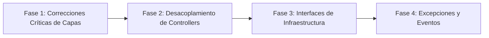

# Plan de Mejoras de Arquitectura — Tatelestai

> **Tipo**: Gestión de Proyecto / Calidad y Refactorización  
> **Objetivo**: Sistematizar las fases de refactorización evolutiva del backend de Tatelestai, detallando el desacoplamiento de controladores hacia Actions puras, DTOs y eventos asíncronos.

---

## Diagnóstico y Objetivos de Diseño

| Aspecto | Estado Inicial | Meta Arquitectónica |
|---|---|---|
| **Separación de Lógica** | Parcial en Actions. | 100% de reglas de negocio encapsuladas en Actions y Enums. |
| **Dirección de Dependencias** | Ciertas Actions dependían de Controllers. | Capa de Dominio totalmente aislada de la capa HTTP. |
| **Entrada de Datos en Actions** | Ciertas Actions recibían `Request $request`. | Actions reciben únicamente DTOs inmutables o primitivos. |
| **Autenticación en Actions** | Uso de `Auth::id()` dentro de Actions. | `$userId` inyectado explícitamente desde la capa de transporte. |
| **Servicios Externos** | Servicios acoplados a implementaciones concretas. | Abstracción formal mediante Interfaces/Contratos (`Contracts/`). |
| **Manejo de Errores** | Mezcla de `\Exception` genéricas en texto plano. | Excepciones de dominio tipadas con códigos HTTP predecibles. |
| **Efectos Secundarios** | Envíos de email síncronos dentro de la petición. | Eventos de dominio y listeners procesados en segundo plano (Queues). |

---

## Fases de Refactorización



---

### Fase 1: Correcciones Críticas de Capas (Inversión de Dependencias)

1. **Eliminar dependencia de Controllers en `AddToCartAction`**:
   * *Diagnóstico*: La Action inyectaba controladores HTTP en su constructor (`OfferController`, `CartController`).
   * *Acción*: Extraer `GetActiveCartAction` y delegar las mutaciones exclusivamente entre Actions o repositorios.
2. **Desacoplar `CreateOfferAction` del objeto HTTP `Request`**:
   * *Diagnóstico*: El método `execute(Request $request)` recibía la clase HTTP directamente, imposibilitando su reutilización en Jobs o comandos CLI.
   * *Acción*: Crear `CreateOfferDTO` y transformar la firma a `execute(CreateOfferDTO $dto, int $userId): Offer`.
3. **Eliminar estado global `Auth::id()` de las Actions**:
   * *Acción*: Inyectar el ID de usuario autenticado como argumento explícito en los métodos `execute(...)`.

---

### Fase 2: Desacoplamiento y Limpieza de Controllers (*Thin Controllers*)

1. **Refactorización de `CustomerSellController`**:
   * `historySell()`: Extraer consulta a `GetCustomerPurchaseHistoryAction` y formatear con `CustomerPurchaseHistoryResource`.
   * `buyOffers()`: Encapsular la transacción completa de compra en `ProcessCustomerPurchaseAction`.
   * `prepareBuyOffers()`: Extraer la generación y expiración del token de reserva a `PreparePurchaseAction`.
2. **Flujo Estándar de Petición**:
   ```text
   HTTP Request 
     ➔ Form Request (Validación de entrada)
     ➔ DTO (Transferencia tipada)
     ➔ Action (Reglas de negocio y transacciones ACID)
     ➔ API Resource (Serialización JSON)
     ➔ HTTP Response
   ```

---

### Fase 3: Infraestructura, Servicios Externos y Configuración

1. **Configuración Robusta de Servicios (`GmailService`)**:
   * Reemplazar llamadas directas a `env()` por `config('services.gmail.username')` para asegurar compatibilidad total con `config:cache` en entornos productivos.
2. **Contratos para APIs de Terceros**:
   * Crear `App\Contracts\PlacesServiceInterface` para `GooglePlacesService`.
   * Inyectar la interfaz y registrar el binding en `AppServiceProvider` para permitir mocking y tests sin costo de cuota en Google Cloud.

---

### Fase 4: Estandarización, Excepciones y Eventos de Dominio

1. **Estandarización PSR-12 (PascalCase)**:
   * Renombrar archivos en camelCase (`makeSellAction.php` ➔ `MakeSellAction.php`, etc.).
2. **Excepciones de Dominio Tipadas (`app/Exceptions/`)**:
   * `InsufficientOfferStockException` (HTTP 409 Conflict).
   * `OfferExpiredException` (HTTP 410 Gone / 422 Unprocessable).
   * `InvalidPurchaseTokenException` (HTTP 400 Bad Request).
   * `UnauthorizedProductAccessException` (HTTP 403 Forbidden).
3. **Desacoplamiento de Notificaciones mediante Eventos**:
   * Disparar evento de dominio `PurchaseCompleted` al cerrar la transacción.
   * Procesar el listener `SendPurchaseConfirmationEmail` mediante el worker de colas de Laravel (`ShouldQueue`).
