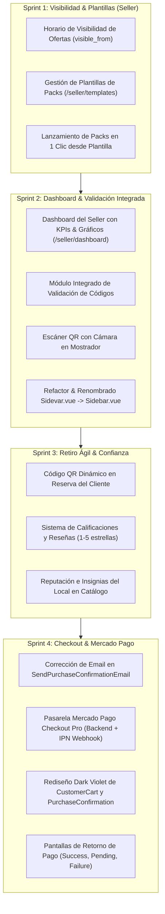
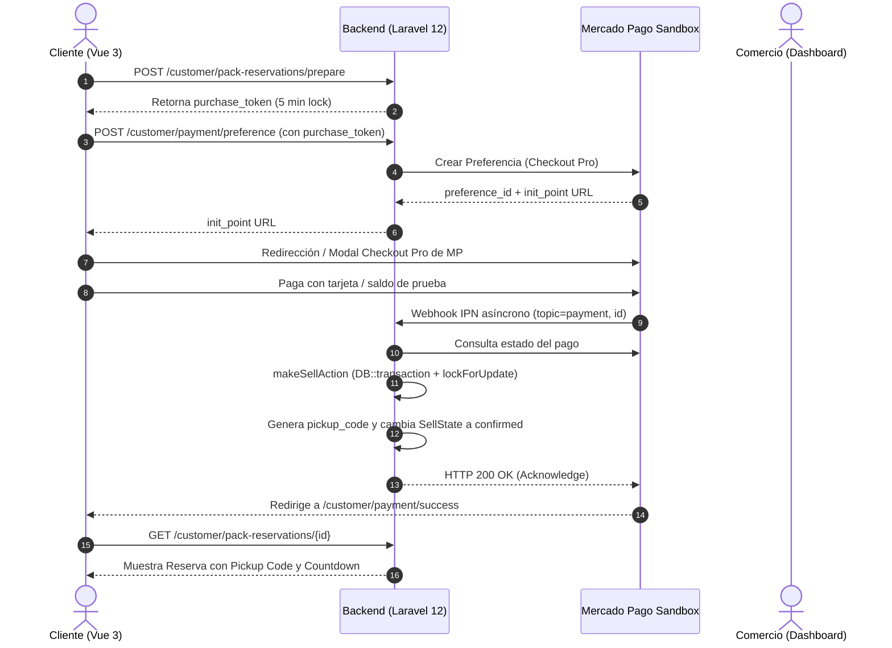

# Plan de Sprints: Customer y Seller (Tatelestai)

> **Tipo**: Gestión de Proyecto / Planificación Operativa  
> **Objetivo**: Definir la planificación detallada de desarrollo dividida en 4 sprints estratégicos para completar y modernizar integralmente los flujos de **Customer (Cliente)** y **Seller (Comercio Gastronómico)**.

---

## 1. Visión General de los 4 Sprints



---

## 2. Sprint 1: Horario de Visibilidad de Ofertas y Gestión de Plantillas (Seller)

### 2.1. Horario de Visibilidad de Ofertas (`visible_from`)
> **Objetivo de Negocio**: Permitir que un comercio programe la publicación de sus excedentes con antelación (ej. cargar a las 11:00 hs una bolsa sorpresa que solo debe estar visible para compra a partir de las 18:00 hs, o publicarla de forma inmediata).

#### Backend (Laravel 12)
1. **Migración de Base de Datos**:
   - Archivo: `database/migrations/YYYY_MM_DD_HHMMSS_add_visible_from_to_offers_table.php`
   ```php
   Schema::table('offers', function (Blueprint $table) {
       $table->timestamp('visible_from')->nullable()->after('pickup_start_datetime');
       $table->index(['state', 'visible_from', 'expiration_datetime'], 'offers_visibility_index');
   });
   ```
2. **DTO y FormRequest**:
   - `StorePackRequest` y `UpdatePackRequest`: agregar regla `'visible_from' => 'nullable|date|before:expiration_datetime'`.
   - `PackDTO`: mapear campo opcional `visible_from`.
3. **Acciones y Modelo**:
   - Actualizar `PublishPackAction` y `UpdatePackAction` para persistir `visible_from`.
   - `Offer.php`:
     - Agregar `'visible_from' => 'datetime'` en `$casts`.
     - Actualizar `toSearchableArray()` para indexar en Typesense (`'visible_from' => $this->visible_from?->timestamp`).
4. **Filtrado de Catálogo (`PackCustomerController::index`)**:
   - Filtrar ofertas para que los clientes solo vean packs cuya visibilidad ya comenzó:
     ```php
     $query = Offer::where('state', OfferState::ACTIVE->value)
         ->where('expiration_datetime', '>=', now())
         ->where(function ($q) {
             $q->whereNull('visible_from')
               ->orWhere('visible_from', '<=', now());
         });
     ```
   - En `TypesenseSearchAdapter`: agregar filtro `"visible_from:<={$now}"`.

#### Frontend (Vue 3)
1. **Wizard de Creación (`CreateOffer.vue`)**:
   - En el Paso 4 (Horarios): Agregar selector de modalidad de visibilidad:
     - *Opción A*: *"Publicar inmediatamente"* (`visible_from = null`).
     - *Opción B*: *"Programar visibilidad"* (elegir fecha y hora a partir de la cual los clientes podrán ver y reservar la bolsa).
2. **Tarjeta de Cliente (`CustomerCard.vue`)**:
   - Si una oferta se muestra en modo previo (o en vista del comercio), indicar con badge: *"Visible a partir de las 18:00 hs"*.

---

### 2.2. Gestión de Plantillas de Packs (`/seller/templates`)
> **Objetivo de Negocio**: Evitar que el comerciante tenga que rellenar el formulario de 4 pasos todos los días. Las plantillas maestras (ej. "Bolsa Sorpresa Mediodía", "Pack Dulce Merienda") se gestionan independientemente y se lanzan con 1 clic asignando cupos y horario del día.

#### Frontend (Vue 3)
1. **Nueva Vista `src/components/layouts/seller/PackTemplates.vue`**:
   - Consumir los endpoints ya existentes en backend:
     - `GET /pack-templates`: Listado de plantillas del local.
     - `POST /pack-templates`: Creación de nueva plantilla (título, descripción, alérgenos, peso estimado, precio, valor mínimo).
     - `PATCH /pack-templates/{id}`: Edición de plantilla.
     - `DELETE /pack-templates/{id}`: Eliminación de plantilla.
   - **Modal "Lanzar Pack Hoy" (1-Click Publish)**:
     - Al presionar *"Publicar Oferta"* en una tarjeta de plantilla, abre un modal simple pidiendo solo:
       1. Cantidad de packs disponibles hoy (ej. 3).
       2. Ventana de retiro de hoy (ej. 20:00 a 21:00 hs).
       3. Horario de visibilidad (inmediato o programado).
     - Envía a `POST /packs` vinculando el `pack_template_id`.
2. **Navegación**:
   - Registrar ruta en `seller-routes.js`:
     ```js
     {
       name: "pack-templates",
       path: "templates",
       component: () => import("@/components/layouts/seller/PackTemplates.vue"),
     }
     ```
   - Agregar enlace con icono atómico en el menú lateral del vendedor.

---

## 3. Sprint 2: Dashboard del Seller y Validación Integrada de Retiros (QR & Código)

### 3.1. Dashboard del Comercio (`/seller/dashboard`)
> **Objetivo de Negocio**: Solucionar el error 404 del Logo en `DashboardLayout.vue` y brindar un centro de mando operativo donde el comercio vea su rendimiento diario e identifique de un vistazo qué pedidos debe entregar hoy.

#### Backend (Laravel 12)
1. **Controlador y Métricas del Vendedor**:
   - En `SellerSellController.php` agregar endpoint `GET /seller/dashboard-stats`:
     - `today_orders_count`: Pedidos confirmados para retirar hoy.
     - `pending_pickups_count`: Pedidos que aún no han sido retirados hoy.
     - `completed_today_count`: Pedidos entregados exitosamente hoy.
     - `active_offers_count`: Ofertas activas publicadas.
     - `week_revenue`: Facturación total de la última semana.
     - `food_saved_kg`: Estimación de kilos de comida rescatados.
     - `recent_sells`: Últimas 5 reservas pendientes de retiro con código y datos del cliente.

#### Frontend (Vue 3)
1. **Nueva Vista `src/components/layouts/seller/SellerDashboard.vue`**:
   - Diseñada bajo la paleta **Dark Violet & Plum** (`#1A1625`, `#2D2438`).
   - **Fila Superior de KPIs**:
     - 📦 *Packs Activos Hoy*.
     - ⏳ *Retiros Pendientes Hoy* (con alerta si falta poco para el cierre).
     - 💰 *Facturación del Mes*.
     - 🌱 *Comida Salvada (kg)*.
   - **Módulo de Acción Rápida**: Botón destacado *"Escanear Código / QR"* y botón *"Publicar Pack"*.
   - **Lista de Retiros de Hoy**: Tabla/tarjetas de los pedidos que deben entregarse en la jornada, ordenados por urgencia de horario de retiro.
2. **Enrutamiento y Menú**:
   - Registrar `/seller/dashboard` en `seller-routes.js` como la página principal del rol seller.
   - Renombrar `Sidevar.vue` a `Sidebar.vue` (corrigiendo el error tipográfico histórico) y actualizar imports en `DashboardLayout.vue`.

---

### 3.2. Validación Rápida y Escáner QR Integrado
> **Objetivo de Negocio**: En lugar de navegar a una página aislada y lenta (`VerifyCode.vue`), el comercio puede validar pedidos directamente desde el Dashboard o mediante un botón flotante/modal rápido con soporte para cámara web/móvil.

#### Componente Modal `src/components/layouts/seller/QuickVerifyModal.vue`
- **Modos de Validación**:
  1. **Modo Escáner (Cámara)**:
     - Utiliza la cámara del dispositivo para leer el código QR que muestra el cliente en su teléfono.
     - Al detectar el QR, procesa automáticamente la verificación sin necesidad de tipear.
  2. **Modo Manual (Teclado)**:
     - Input grande monoespaciado con autofoco y formateo automático de guiones (`XXXX-XXXX-XXXX`).
     - Verificación instantánea al completar los caracteres.
- **Acción de Entrega**:
  - Muestra inmediatamente la ficha del cliente, foto/nombre del pack y precio.
  - Botón verde esmeralda: *"Confirmar Entrega del Pack"* (llama a `POST /complete-sell/{sellNumber}`).
  - Actualiza en vivo el listado de pendientes en el Dashboard sin recargar la página.

---

## 4. Sprint 3: Retiro Ágil (QR Cliente) y Sistema de Confianza (Reseñas)

### 4.1. Código QR Dinámico en Reserva del Cliente
> **Objetivo de Negocio**: Permitir que el cliente simplemente muestre la pantalla de su teléfono con el QR para que el comercio lo escanee en segundos.

#### Frontend (Vue 3)
1. **Componente `PurchaseCard.vue`**:
   - Agregar botón *"Ver Código QR"* junto al código en texto.
   - Generación de QR dinámico (usando SVG ligero o canvas con el payload `TAT:<pickup_code>:<sell_id>`).
   - Modal ampliado con fondo blanco de alto contraste para que el escáner del vendedor lo lea con facilidad incluso en condiciones de poca luz.

---

### 4.2. Sistema de Calificaciones y Reseñas (Reviews & Ratings)
> **Objetivo de Negocio**: Al retirar un pack sorpresa, el cliente califica la experiencia (1 a 5 estrellas) y selecciona etiquetas de feedback. Esto genera la puntuación promedio del comercio visible en el catálogo.

#### Backend (Laravel 12)
1. **Migración de Base de Datos**:
   - Crear tabla `establishment_reviews`:
     ```php
     Schema::create('establishment_reviews', function (Blueprint $table) {
         $table->id();
         $table->timestamps();
         $table->unsignedBigInteger('sell_id')->unique();
         $table->foreign('sell_id')->references('id')->on('sells')->onDelete('cascade');
         $table->unsignedBigInteger('customer_id');
         $table->foreign('customer_id')->references('id')->on('users');
         $table->unsignedBigInteger('food_establishment_id');
         $table->foreign('food_establishment_id')->references('id')->on('food_establishments');
         $table->tinyInteger('rating'); // 1 a 5 estrellas
         $table->text('comment')->nullable();
         $table->json('positive_tags')->nullable(); // ej: ["Buena cantidad", "Muy fresco", "Atención rápida"]
     });
     ```
2. **Endpoints y Controladores**:
   - `POST /api/customer/pack-reservations/{sellId}/review`:
     - Valida que la venta esté en estado `picked_up` (is_picked_up = true) y pertenezca al cliente autenticado.
     - Valida que no exista ya una reseña para esa venta.
   - `GET /api/establishments/{id}/reviews`: Reseñas públicas y puntuación promedio del local.
3. **Acciones de Negocio**:
   - `CreateReviewAction`: Persiste la reseña y actualiza de forma eficiente el rating promedio y total de reseñas en `FoodEstablishment`.

#### Frontend (Vue 3)
1. **Modal de Calificación en `HistoryCard.vue`**:
   - Botón *"Calificar experiencia"* en las compras retiradas.
   - Selector de 5 estrellas con animación interactiva.
   - Chips seleccionables de feedback ("Comida deliciosa", "Abundante", "Puntual").
2. **Visualización de Reputación**:
   - Mostrar estrellas promedio (ej. `⭐ 4.8 (42 reseñas)`) en `CustomerCard.vue` y en `EstablishmentView.vue`.

---

## 5. Sprint 4: Checkout y Pasarela de Pagos (Mercado Pago)

### 5.1. Corrección de Email en Confirmación de Compra
- **Archivo**: `Backend/example-app/app/Listeners/SendPurchaseConfirmationEmail.php`
- **Corrección**: Descomentar el envío al correo real del cliente autenticado (`Mail::to($sell->customer->email)->send(...)`) y eliminar el correo hardcodeado de prueba.

---

### 5.2. Integración de Mercado Pago Checkout Pro
> **Objetivo de Negocio**: Reemplazar la compra simulada actual por una pasarela de pago real (modo Sandbox para desarrollo/tesis), garantizando cobro electrónico, control de concurrencia de stock y conciliación asíncrona mediante Webhooks IPN.



#### Backend (Laravel 12)
1. **Instalación y Configuración**:
   - Integrar SDK oficial o cliente HTTP para Mercado Pago en `Backend/example-app/`.
   - Variables de entorno en `.env`: `MERCADOPAGO_ACCESS_TOKEN`, `MERCADOPAGO_PUBLIC_KEY`, `MERCADOPAGO_WEBHOOK_SECRET`.
2. **Modelo de Datos**:
   - Migración para agregar a la tabla `sells`:
     - `payment_id` (string nullable).
     - `payment_status` (`pending`, `approved`, `rejected`, `refunded`).
     - `payment_method` (string nullable: `account_money`, `credit_card`, etc.).
3. **Servicio de Pagos (Patrón Adapter)**:
   - Contrato `PaymentServiceInterface`.
   - Implementación `MercadoPagoPaymentAdapter`:
     - `createPreference(PreparePurchaseDTO $dto, User $customer): array`
     - `getPaymentDetails(string $paymentId): array`
     - `refundPayment(string $paymentId): bool` (integrado con la política de cancelación ya implementada).
4. **Endpoints y Webhooks**:
   - `POST /api/customer/payment/create-preference`: Genera el `preference_id` para el frontend.
   - `POST /api/webhooks/mercadopago`: Endpoint público (exento de CSRF y autenticación de sesión) que valida la firma del webhook, consulta el pago a Mercado Pago y confirma la venta de manera idempotente.

#### Frontend (Vue 3)
1. **Rediseño Dark Violet de `CustomerCart.vue`**:
   - Migrar estilos a Tailwind CSS y paleta oficial (`#1A1625`, `#2D2438`, `#7C3AED`).
   - Botón *"Proceder al Pago"* conectado con la preparación del pedido.
2. **Rediseño de `PurchaseConfirmation.vue`**:
   - Botón *"Pagar con Mercado Pago"* con el distintivo logo / botón de Checkout Pro.
3. **Pantallas de Feedback Post-Pago**:
   - `/customer/payment/success`: Confirmación con confeti, número de orden y botón directo a *"Ver mi código de retiro"*.
   - `/customer/payment/pending`: Aviso de pago en proceso.
   - `/customer/payment/failure`: Mensaje amigable con motivo del rechazo y botón para reintentar.

---

## 6. Plan de Verificación y Testing por Sprint

### Comandos de Testing Automatizado (Pest PHP)
```bash
# Sprint 1: Visibilidad y Plantillas
docker exec tatelestai-php-fpm php artisan test tests/Feature/OfferVisibilityTest.php tests/Feature/PackTemplateControllerTest.php

# Sprint 2: Dashboard del Seller y Validación
docker exec tatelestai-php-fpm php artisan test tests/Feature/SellerDashboardTest.php tests/Feature/SellerSellControllerTest.php

# Sprint 3: Reseñas y Retiro
docker exec tatelestai-php-fpm php artisan test tests/Feature/EstablishmentReviewTest.php

# Sprint 4: Pagos y Webhook IPN
docker exec tatelestai-php-fpm php artisan test tests/Feature/MercadoPagoWebhookTest.php tests/Feature/CustomerCancelPurchaseTest.php
```

### Protocolo de Verificación Manual
1. **Comercio**:
   - Crear una plantilla y lanzar un pack en 1 clic programado para las 18:00 hs.
   - Entrar al Dashboard y verificar que los KPIs del día y gráficos respondan.
   - Abrir el modal de validación rápida y escanear el QR con la cámara.
2. **Cliente**:
   - Comprobar que los packs con `visible_from` futuro respeten la regla en el catálogo.
   - Comprar un pack mediante Mercado Pago Checkout Pro (Sandbox).
   - Ver el código QR en *Mis Reservas* y presentarlo para ser escaneado.
   - Tras el retiro, calificar el pack con 5 estrellas y feedback.
