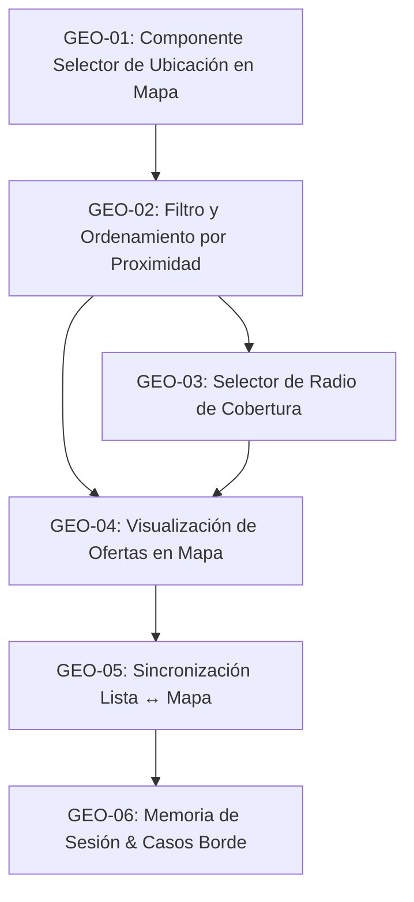

# Especificación de Tareas: Búsqueda Geolocalizada por Selección en Mapa

> **Contexto**: Tatelestai — Plataforma de rescate de alimentos por proximidad.  
> **Documento de referencia**: [Análisis de Priorización de Tareas](./analisis-priorizacion-tareas.md) (Tarea prioritaria #1).  
> **Alcance actual**: La ubicación del usuario se define **exclusivamente mediante selección manual de un punto sobre un mapa interactivo en el navegador** (sin solicitar permisos de geolocalización/GPS automática por el momento).  
> **Propósito**: Guía funcional y secuencial para que un agente de IA o desarrollador implemente la funcionalidad paso a paso, sin ambigüedades y sin detalles técnicos de bajo nivel.

---

## Objetivo General
Permitir que el cliente defina su ubicación de referencia **haciendo clic o posicionando un marcador directamente sobre un mapa interactivo en el navegador**, ajustando un radio de cobertura en kilómetros y visualizando las ofertas más cercanas tanto en el listado de tarjetas como en el mapa interactivo.

---

## Desglose Secuencial de Tareas

### Tarea 1: Componente Selector de Ubicación en Mapa Interactivo
- **Identificador**: `GEO-01`
- **Objetivo**: Proveer una interfaz visual amigable donde el usuario pueda hacer clic en un mapa para marcar su punto de referencia de búsqueda.
- **Precondiciones**: El usuario se encuentra en el catálogo de ofertas del cliente.
- **Flujo y Comportamiento**:
  1. En la parte superior del catálogo (junto a la barra de búsqueda) se muestra un botón accesible: **"Fijar mi ubicación en el mapa"** (o **"Seleccionar ubicación"**).
  2. Al presionarlo, se abre una ventana o modal con un mapa interactivo centrado en una zona predeterminada (ej. el casco urbano principal de la ciudad).
  3. El usuario puede:
     - Hacer clic en cualquier calle o punto del mapa para colocar el marcador de "Mi punto de búsqueda".
     - Arrastrar el marcador libremente para ajustar con precisión su ubicación.
  4. La interfaz presenta dos acciones claras:
     - **"Confirmar esta ubicación"**: Establece las coordenadas seleccionadas como el punto activo para la búsqueda de ofertas.
     - **"Cancelar"**: Cierra la ventana sin modificar la configuración previa.
- **Criterios de Aceptación**:
  - Al hacer clic o arrastrar en el mapa, el pin se sitúa de forma inmediata en el punto señalado.
  - Al confirmar, el punto queda registrado como la referencia activa y se cierra el modal.
  - Si el usuario cancela, no se aplica ningún cambio.

---

### Tarea 2: Filtro y Ordenamiento por Proximidad en el Catálogo
- **Identificador**: `GEO-02`
- **Objetivo**: Aplicar el punto seleccionado en el mapa a las búsquedas y ordenar el catálogo priorizando las ofertas más cercanas.
- **Precondiciones**: Se ha confirmado un punto de referencia en el mapa (`GEO-01`).
- **Flujo y Comportamiento**:
  1. Cuando existe un punto de ubicación confirmado:
     - Las ofertas cargadas se filtran para incluir únicamente los comercios dentro del radio de cobertura activo.
     - Los resultados se ordenan de menor a mayor distancia física respecto al punto marcado.
     - Cada tarjeta de oferta en el catálogo muestra una etiqueta con la distancia calculada (ej. *"a 350 m"*, *"a 1.8 km"*).
  2. Junto a la barra de búsqueda se muestra un indicador visible con el estado actual:
     - Ejemplo: *"Buscando cerca de tu ubicación seleccionada"* acompañado de un botón para **"Cambiar"** o **"Quitar"**.
  3. Si no hay ubicación activa (estado por defecto al entrar por primera vez o si el usuario la quita), el catálogo muestra las ofertas de forma general sin filtro de proximidad ni cálculo de distancias.
- **Criterios de Aceptación**:
  - El catálogo filtra y ordena las ofertas en función de la distancia al punto marcado en el mapa.
  - Cada tarjeta de oferta muestra la distancia relativa hacia ese punto.
  - Es evidente en todo momento si el catálogo está filtrado por proximidad o en modo general.

---

### Tarea 3: Selector de Radio de Cobertura Dinámico
- **Identificador**: `GEO-03`
- **Objetivo**: Permitir al usuario ampliar o reducir la distancia máxima a la que desea buscar ofertas.
- **Precondiciones**: Existe un punto de referencia activo (`GEO-01`).
- **Flujo y Comportamiento**:
  1. Cuando hay una ubicación activa, se habilitan controles de selección rápida de distancia junto a la búsqueda (ej. opciones de 1 km, 3 km, 5 km, 10 km).
  2. Se define un radio inicial recomendado por defecto (ej. 3 km).
  3. Al cambiar el radio, el catálogo se actualiza de inmediato con las ofertas que caen dentro del nuevo límite.
  4. Si no existen ofertas dentro del radio elegido, se muestra un mensaje informativo que invita a ampliar el radio o mover el pin en el mapa.
- **Criterios de Aceptación**:
  - El usuario puede cambiar el radio con un solo clic.
  - El listado de resultados se refresca al instante sin recargar la página completa.

---

### Tarea 4: Visualización de Ofertas en el Mapa Interactivo
- **Identificador**: `GEO-04`
- **Objetivo**: Mostrar en un mapa la relación espacial entre el punto elegido por el usuario y los comercios que tienen ofertas activas.
- **Precondiciones**: Existe un punto seleccionado y ofertas dentro del radio (`GEO-02`, `GEO-03`).
- **Flujo y Comportamiento**:
  1. El mapa muestra:
     - **Marcador del usuario**: El punto de referencia seleccionado en el mapa.
     - **Marcadores de comercios**: Los establecimientos con ofertas disponibles dentro del radio.
  2. Al hacer clic sobre el marcador de un comercio, se despliega una tarjeta flotante o popup con:
     - Nombre del comercio y dirección.
     - Título de la oferta, precio actual y distancia estimada.
     - Botón de acceso directo para abrir el detalle completo de la oferta.
  3. Los comercios fuera del radio seleccionado no se muestran en el mapa.
- **Criterios de Aceptación**:
  - Se distingue claramente el marcador de ubicación del usuario respecto a los marcadores de las tiendas.
  - Los pines de comercios reflejan con exactitud las ofertas disponibles en el radio.
  - Al interactuar con un pin se puede previsualizar la oferta y acceder a ella.

---

### Tarea 5: Alternancia y Sincronización entre Lista y Mapa
- **Identificador**: `GEO-05`
- **Objetivo**: Permitir al usuario explorar las ofertas alternando libremente entre la lista de tarjetas y el mapa.
- **Precondiciones**: El listado de ofertas (`GEO-02`) y el mapa (`GEO-04`) están implementados.
- **Flujo y Comportamiento**:
  1. La interfaz dispone de un control visual (pestañas o botones) para alternar entre:
     - **Vista Tarjetas**: Cuadrícula tradicional de ofertas.
     - **Vista Mapa**: Vista cartográfica con los pines de comercios y del usuario.
  2. Ambas vistas comparten en todo momento los mismos filtros (texto buscado, radio y punto de ubicación).
  3. Interacción bidireccional:
     - Pasar el cursor o hacer clic sobre una oferta en la lista resalta su marcador correspondiente en el mapa.
     - Hacer clic en un marcador en el mapa enfoca la oferta en la lista.
- **Criterios de Aceptación**:
  - Cambiar entre vista de lista y vista de mapa no reinicia la búsqueda ni borra la ubicación elegida.
  - Los filtros aplicados se reflejan por igual en ambas vistas.

---

### Tarea 6: Memoria de Sesión, Modo Catálogo General y Casos Borde
- **Identificador**: `GEO-06`
- **Objetivo**: Preservar la comodidad de navegación durante la sesión y resolver escenarios sin resultados.
- **Precondiciones**: Flujo base de geolocalización manual funcional.
- **Flujo y Comportamiento**:
  1. **Persistencia en la sesión**: El punto marcado en el mapa se recuerda durante toda la navegación del usuario en el sitio (evitando tener que volver a marcarlo al abrir un detalle de oferta y regresar, o al recargar la página).
  2. **Opción "Quitar ubicación"**: El usuario puede en cualquier momento presionar un botón para eliminar el filtro de distancia y regresar al catálogo general completo.
  3. **Zona sin ofertas**: Si no se encuentran ofertas dentro del radio seleccionado, se presenta un mensaje orientador: *"No encontramos ofertas dentro de [X] km de tu punto marcado. Prueba ampliando el radio o eligiendo otra zona en el mapa."*
  4. **Estados de carga**: Durante la consulta de ofertas se presentan esqueletos o indicadores visuales de carga.
- **Criterios de Aceptación**:
  - La posición seleccionada se mantiene activa durante la sesión del navegador.
  - El usuario puede alternar fácilmente entre su búsqueda localizada y el catálogo general sin fricción.

---

## Flujo de Dependencias y Orden de Ejecución para la IA

