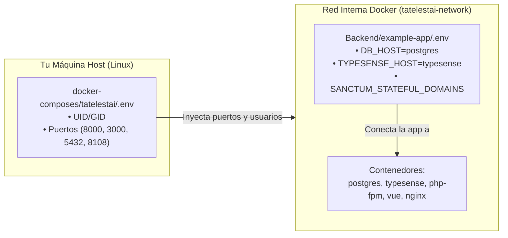

# 🔐 Tutorial: Configuración de Variables de Entorno (.env)

> **Tipo**: Tutorial / Guía Práctica  
> **Objetivo**: Configurar correctamente las variables de entorno de **Docker Compose** y **Laravel** para el proyecto Tatelestai, entendiendo el propósito de cada servicio y credencial (Base de datos, Typesense, Gmail SMTP y Google APIs).

---

## 📌 Visión General de la Arquitectura de Variables

El proyecto Tatelestai utiliza **dos archivos `.env` independientes** que trabajan de forma sincronizada:

1. **`docker-composes/tatelestai/.env`**: Define la infraestructura de Docker (puertos expuestos en tu máquina host, usuarios/permisos de Linux y credenciales de los contenedores).
2. **`Backend/example-app/.env`**: Configura la aplicación Laravel (conexión interna a Postgres, Typesense, autenticación Sanctum para Vue, correos SMTP y APIs externas de Google).



---

##  Configuración Paso a Paso

Sigue las siguientes secciones para preparar tus archivos de entorno a partir de las plantillas `.env.example`:

---

### Paso 1: Configurar Docker Compose (`docker-composes/tatelestai/.env`)

Copia la plantilla:
```bash
cp docker-composes/tatelestai/.env.example docker-composes/tatelestai/.env
```

Abre el archivo para revisar las siguientes secciones:

#### 1.1 Permisos de usuario en Linux (`UID` y `GID`)
```env
UID=1000
GID=1000
```
* **¿Para qué sirve?**: En Linux, los archivos generados dentro del contenedor (logs de Laravel, archivos en `storage/`, caché) deben pertenecer a tu usuario no-root para que puedas editarlos en el host sin errores de permisos.
* **Comprobación**: Ejecuta `id -u` e `id -g` en tu terminal. Si devuelven `1000`, déjalo tal cual. Si tu usuario tiene otro ID (ej. `1001`), actualiza estos campos.

#### 1.2 Puertos de acceso en el Host
```env
NGINX_PORT=8000
VITE_PORT=3000
POSTGRES_PORT=5432
TYPESENSE_PORT=8108
```
* Define en qué puertos de tu máquina física escucharán los servicios. Si tienes otro PostgreSQL corriendo localmente en el puerto 5432, puedes cambiar `POSTGRES_PORT=5433`.

#### 1.3 Credenciales de Base de Datos y Motor de Búsqueda
```env
POSTGRES_DB=tatelestai_db
POSTGRES_USER=tatelestai
POSTGRES_PASSWORD=secret

TYPESENSE_API_KEY=xyz
```
* Estas son las credenciales maestras con las que los contenedores de Postgres y Typesense inicializan sus almacenes de datos.

---

### Paso 2: Configurar Backend Laravel (`Backend/example-app/.env`)

Copia la plantilla:
```bash
cp Backend/example-app/.env.example Backend/example-app/.env
```

#### 2.1 Identidad y URLs de la Aplicación
```env
APP_NAME=Tatelestai
APP_ENV=local
APP_KEY=
APP_DEBUG=true
APP_TIMEZONE=America/Argentina/Buenos_Aires
APP_URL=http://localhost:8000
```
* **`APP_KEY`**: Se generará automáticamente más adelante mediante el comando `php artisan key:generate`.
* **`APP_URL`**: Debe apuntar al puerto expuesto por Nginx (`http://localhost:8000`).

#### 2.2 Base de Datos (PostgreSQL)
```env
DB_CONNECTION=pgsql
DB_HOST=postgres
DB_PORT=5432
DB_DATABASE=tatelestai_db
DB_USERNAME=tatelestai
DB_PASSWORD=secret
```
> ⚠️ **Importante**: `DB_HOST` debe ser `postgres` (el nombre del servicio en Docker Compose). No pongas `127.0.0.1` ni `localhost` aquí, porque dentro de la red del contenedor, `localhost` sería el propio contenedor PHP-FPM y no el de Postgres.

#### 2.3 Sesión, Sanctum y CORS (Conexión con Vue 3)
```env
SESSION_DRIVER=database
SESSION_LIFETIME=120
SESSION_ENCRYPT=false
SESSION_PATH=/
SESSION_DOMAIN=localhost

FRONTEND_URL=http://localhost:3000
SANCTUM_STATEFUL_DOMAINS=localhost:3000,localhost:8000
```
* **`SANCTUM_STATEFUL_DOMAINS`**: Crucial para la autenticación SPA con cookies. Permite que el frontend en `localhost:3000` envíe peticiones autenticadas a `localhost:8000` sin que el navegador bloquee las cookies de sesión (CORS / SameSite).

#### 2.4 Motor de Búsqueda (Laravel Scout & Typesense)
```env
SCOUT_DRIVER=typesense
TYPESENSE_API_KEY=xyz
TYPESENSE_HOST=typesense
TYPESENSE_PORT=8108
SCOUT_QUEUE=false
TYPESENSE_PATH=
TYPESENSE_PROTOCOL=http
```
* **`TYPESENSE_HOST=typesense`**: Al igual que con Postgres, PHP se comunica con Typesense a través del nombre de servicio interno de Docker.
* **`TYPESENSE_API_KEY`**: Debe coincidir exactamente con el valor definido en `docker-composes/tatelestai/.env`.

---

### Paso 3: Configurar Servicios Externos (Gmail y Google Maps)

En tu instalación previa de Tatelestai tienes configurados dos servicios de terceros esenciales para el funcionamiento completo:

#### 3.1 Envíos de Correo Transaccional (Gmail SMTP)
El sistema envía correos de verificación, restablecimiento de contraseña y confirmación de compras/reservas:

```env
MAIL_MAILER=smtp
MAIL_SCHEME=null
MAIL_HOST=smtp.gmail.com
MAIL_PORT=587
MAIL_USERNAME=tu_correo@gmail.com
MAIL_PASSWORD=tu_clave_de_aplicacion_de_16_caracteres
MAIL_ENCRYPTION=tls
MAIL_FROM_ADDRESS="tu_correo@gmail.com"
MAIL_FROM_NAME="${APP_NAME}"
```

##### ¿Cómo obtener la Contraseña de Aplicación de Gmail?
1. Ve a tu [Cuenta de Google](https://myaccount.google.com/).
2. Entra en la pestaña **Seguridad**.
3. Asegúrate de tener activa la **Verificación en 2 pasos**.
4. En el buscador de la cuenta escribe **Contraseñas de aplicaciones** (App passwords).
5. Crea una nueva contraseña asignándole un nombre (ej. `Tatelestai Dev`).
6. Copia el código generado de 16 caracteres (sin espacios) y colócalo en `MAIL_PASSWORD`.

---

#### 3.2 Geolocalización y Mapas (Google Places & Maps API)
Tatelestai utiliza Google APIs para autocompletar domicilios de comercios gastronómicos, calcular distancias y georreferenciar ofertas en el mapa:

```env
GOOGLE_PLACES_API_KEY=tu_api_key_aqui
GOOGLE_MAPS_API_KEY=tu_api_key_aqui
```

##### ¿Cómo obtener las API Keys?
1. Ingresa a [Google Cloud Console](https://console.cloud.google.com/).
2. Selecciona o crea un proyecto para Tatelestai.
3. Dirígete a **APIs y servicios > Biblioteca** y habilita:
   * **Places API (New)**
   * **Maps JavaScript API**
   * **Geocoding API**
4. Dirígete a **Credenciales**, pulsa en **Crear credenciales > Clave de API** y copia la clave en ambas variables.

---

## 🔍 Checklist de Verificación de Variables

Antes de iniciar la aplicación con Docker, confirma:

- [ ] `UID` y `GID` en `docker-composes/tatelestai/.env` coinciden con tu usuario Linux (`id -u`).
- [ ] `DB_HOST=postgres` en `Backend/example-app/.env`.
- [ ] `TYPESENSE_HOST=typesense` en `Backend/example-app/.env`.
- [ ] `TYPESENSE_API_KEY` es idéntica en ambos archivos `.env`.
- [ ] Si vas a probar login con cookies, `SANCTUM_STATEFUL_DOMAINS` contiene `localhost:3000,localhost:8000`.
- [ ] Si vas a probar notificaciones de email o mapas, las claves de Gmail y Google Maps están presentes.

